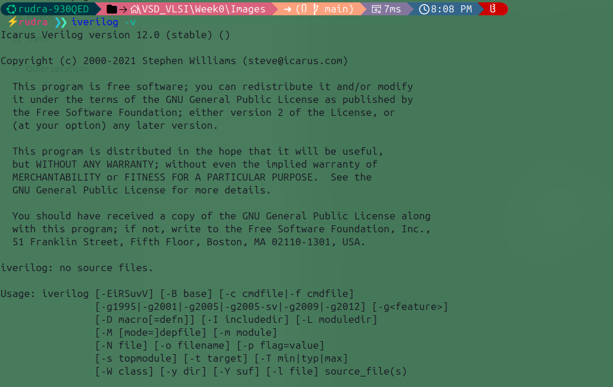
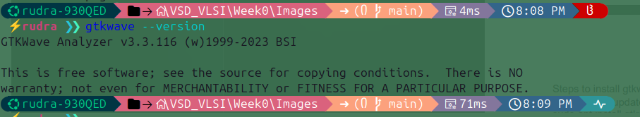
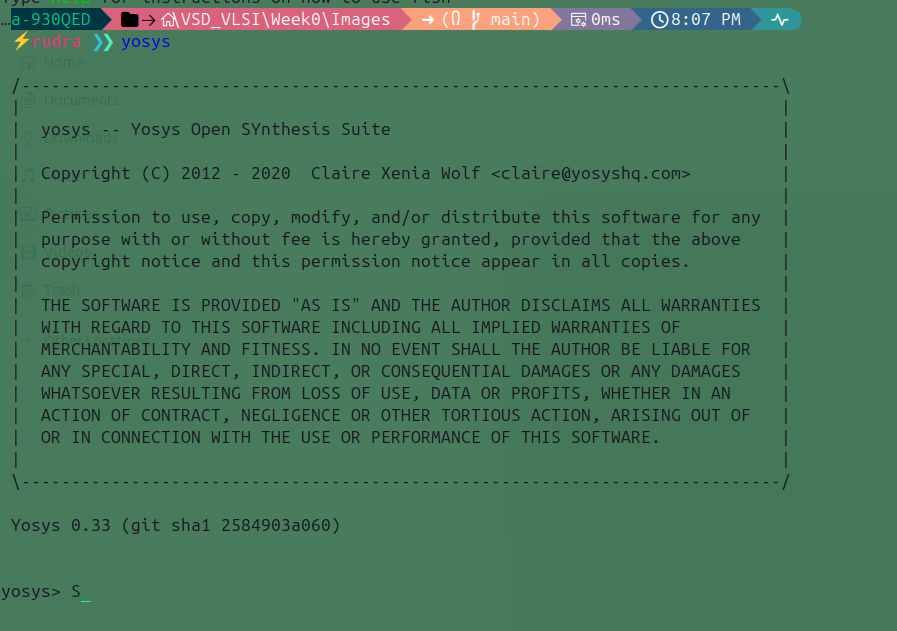
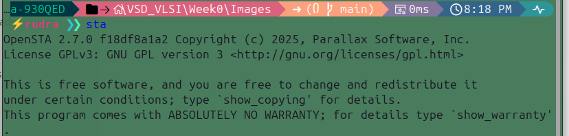

# Week 0 Submission – Tools Installation

## Title: Tools Installation for Verilog Synthesis and RTL Simulation  

This repository documents the installation of essential tools required for Verilog synthesis, RTL simulation, and analysis. These open-source tools are widely used in both academic and industrial settings, providing a lightweight and free alternative to proprietary software like Quartus Prime and Xilinx Vivado.  

---

## Recommended System Requirements  
- **OS**: Ubuntu 22.04+  
- **RAM**: 8 GB  
- **CPU**: 4 cores  
- **Disk Space**: 10 GB  

---

## Tools Covered  

### 1. Icarus Verilog (iverilog)  
Icarus Verilog is a lightweight Verilog simulation and synthesis tool. It generates simulation output that can be visualized using GTKWave.  

#### Installation  

#### Ubuntu:
```bash
sudo apt update
sudo apt install iverilog gtkwave

```
#### Fedora:
```bash
sudo dnf update
sudo dnf install iverilog gtkwave

```

#### Verify Installation  

```bash
iverilog -V
```
#### Expected output:

---
### 2. GTKWave

GTKWave is a waveform viewer that allows you to analyze simulation output signals from Icarus Verilog.

Installed alongside Icarus Verilog (see above).

To run:
```bash
gtkwave
```
You can also launch it from your system application drawer.

#### Expected output:

---
### 3. Yosys

Yosys is a powerful open-source RTL synthesis tool used for FPGA and ASIC flows.

Recommended Method – OSS CAD Suite

Download pre-compiled binaries from the [OSS CAD Suite GitHub releases](https://github.com/YosysHQ/oss-cad-suite-build/releases)
.

Extract the archive and source the environment file:
```bash
source environment
```
#### Alternative – Install via apt (Linux only)
```bash
sudo apt update
sudo apt install yosys
```
#### Verify Installation
```bash
yosys --version
```
#### Build from Source (Advanced)

For the latest version:
```bash
sudo apt update
sudo apt install -y build-essential clang bison flex \
                   libreadline-dev gawk tcl-dev libffi-dev \
                   git graphviz xdot pkg-config python3

git clone https://github.com/YosysHQ/yosys.git
cd yosys
make
sudo make install
```

#### Expected output:

---
### 4. OpenSTA

OpenSTA is an open-source Static Timing Analysis (STA) tool, essential for verifying timing closure in digital circuits.

#### Install Dependencies
```bash
sudo apt update
sudo apt install -y build-essential clang cmake swig tcl-dev zlib1g-dev \
                    libeigen3-dev bison flex
```
#### Build & Install CUDD (dependency)
```bash
tar xvfz cudd-3.0.0.tar.gz
cd cudd-3.0.0
./configure --prefix=/home/<username>/cudd-install
make
make install
```
#### Build & Install OpenSTA
```bash
git clone https://github.com/The-OpenROAD-Project/OpenSTA.git
cd OpenSTA
mkdir build && cd build
cmake -DCUDD_DIR=/home/<username>/cudd-install ..
make
sudo make install
```
#### Verify Installation
```bash
sta
```
#### Expected output:

---
## Conclusion
This setup includes:

- **Icarus Verilog** – RTL simulation
- **GTKWave** – Waveform viewing
- **Yosys** – RTL synthesis
- **OpenSTA** – Static timing analysis

All tools are free, open-source, and widely used in academia and industry, making them ideal for learning and professional use.
