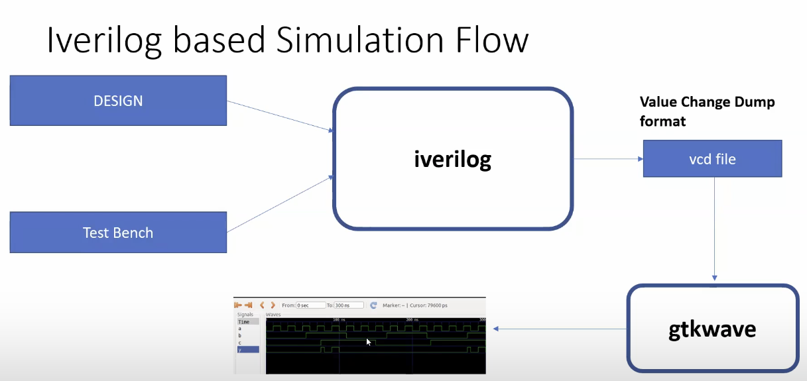
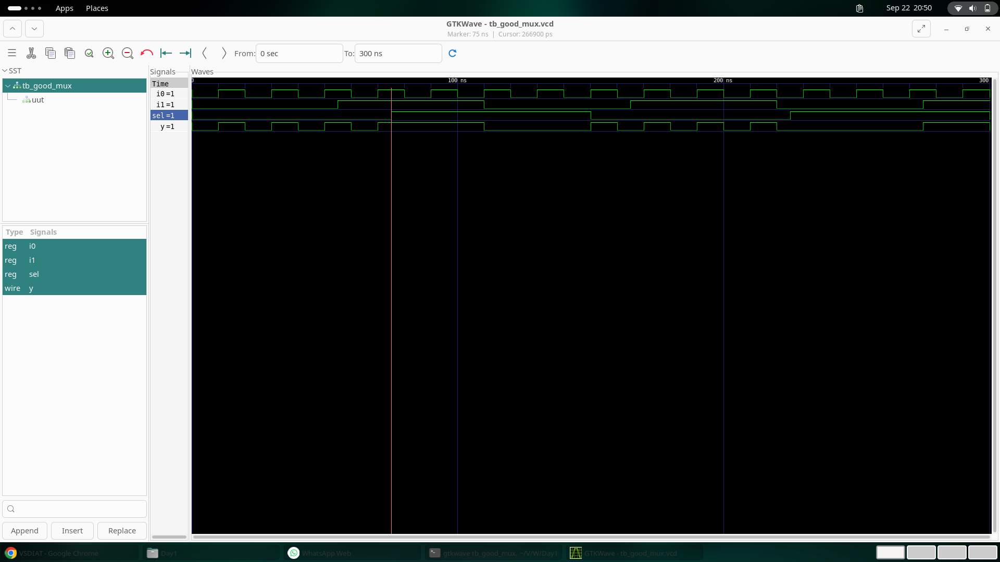
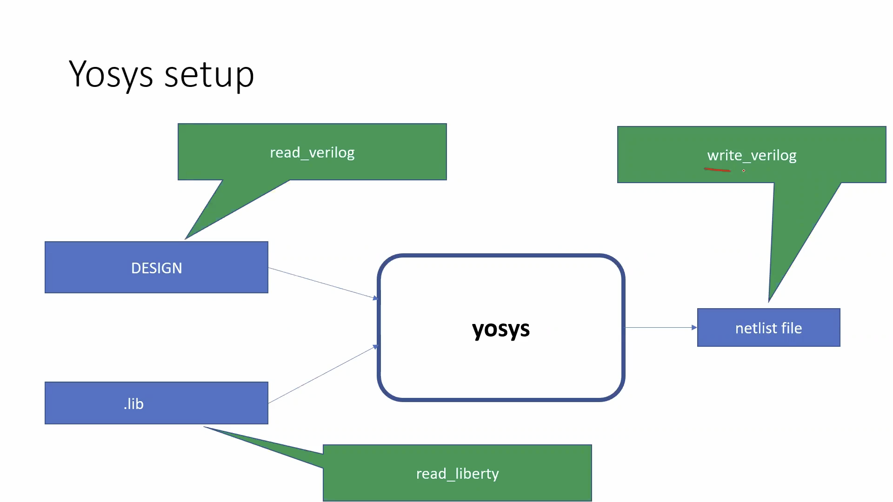
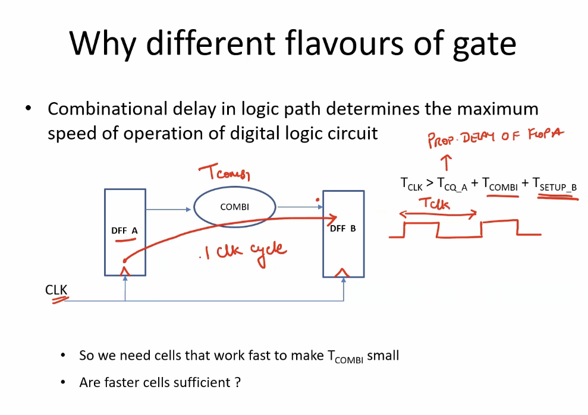
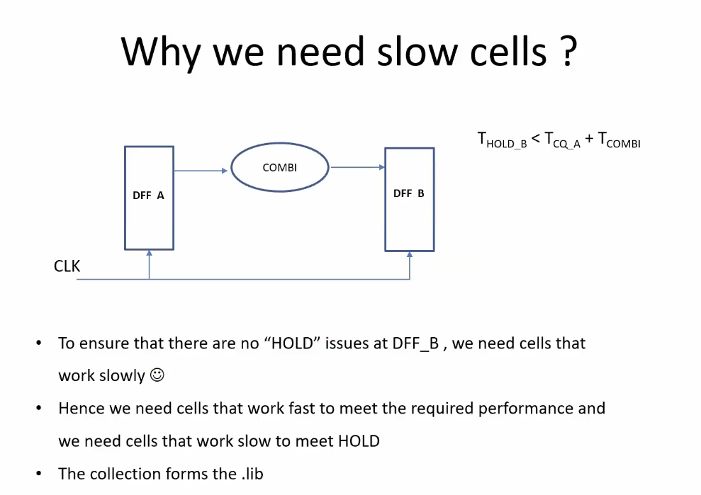
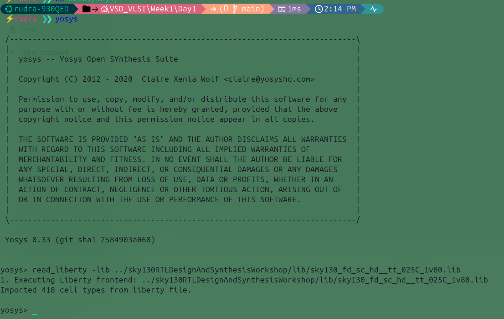
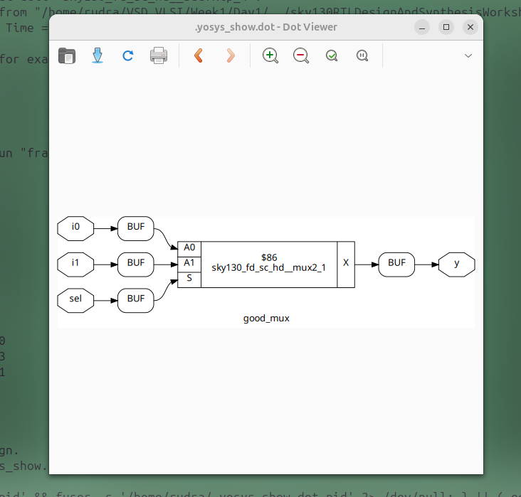

# 🌟 Day 1 – Introduction to Verilog RTL Design and Synthesis  

This repository documents **Day 1 of Week 1** in the **RISC-V Reference SoC Tapeout Program**.  
On this day, I explored the basics of **RTL design, simulation, and synthesis** using open-source tools.  

## 📑 Table of Contents  

<details>
<summary>Click to expand</summary>

1. [Introduction to Open-Source Simulator – iverilog](#1-introduction-to-open-source-simulator--iverilog)  
   - What is Verilog HDL?  
   - What is iverilog?  
   - Simulation Flow  
   - Verification Approaches  

2. [Labs using iverilog and GTKWave](#2-labs-using-iverilog-and-gtkwave)  
   - Cloning the Repository  
   - Simulating a 2x1 MUX  
   - Generating VCD Files  
   - Viewing Results with GTKWave  

3. [Introduction to Yosys and Logic Synthesis](#3-introduction-to-yosys-and-logic-synthesis)  
   - What is Yosys?  
   - Gate-Level Netlist  
   - Standard Cell Libraries  
   - Timing Parameters (Setup & Hold Time)  

4. [Labs using Yosys and Sky130 PDKs](#4-labs-using-yosys-and-sky130-pdks)  
   - RTL to Netlist Flow  
   - Post-Synthesis Simulation  

5. [Key Takeaways from Day 1](#-key-takeaways-from-day-1)  

</details>


## 1. Introduction to Open-Source Simulator – **iverilog**

In this lecture, I learned about **Verilog HDL** and its simulation using **iverilog**.  

- **Verilog HDL**: A hardware description language (HDL) used to describe the behavior and structure of digital systems.  
  - Influenced by C language.  
  - Case-sensitive.  
  - Two widely used HDLs are **Verilog** and **VHDL**.  

- **iverilog**: An open-source tool used for **RTL simulation** of Verilog designs.  

📌 **Flow of iverilog simulation**  
  

To simulate a design, we need **two files**:  
1. **Design file** – contains the circuit implementation.  
2. **Testbench file** – applies input test vectors and verifies outputs.  

### Approaches to verification:
- **Direct Testbench**: Apply test vectors and compare results.  
- **DUT (Design Under Test)**: Testbench generates inputs automatically and checks DUT outputs, often giving feedback or scores.  

---

## 2. Labs using **iverilog** and **GTKWave**  

### 🔹 Step 1: Clone the repository  
```bash
git clone https://github.com/kunalg123/sky130RTLDesignAndSynthesisWorkshop.git
cd sky130RTLDesignAndSynthesisWorkshop/verilog_files
```
This repo contains Sky130 standard cells and demo designs.

### 🔹 Step 2: Simulate a 2x1 MUX
Then install the required softwares as week 0.
To simulate 2x1 mux we type
```bash 
iverilog good_mux.v tb_good_mux.v
```
where good_mux.v is our design and tb_good_mux.v is our testbench

to execute the simulation we type
```bash
./a.out
```
This generates a VCD (Value Change Dump) file, e.g., tb_good_mux.vcd.
The VCD file contains metadata such as date, simulator version, and timescale.

To enable waveform dumping, include these in the testbench:
```verilog
$dumpfile("tb_good_mux.vcd");
$dumpvars(0, tb_good_mux);
```
in initial block of the testbench

### 🔹 Step 3: View Waveform with GTKWave
in our terminal.
to view our simulation result we use another tool named as GTK wave. It is the waveform viewer tool which shows simulation results in waveform. note that it required.vcd file to view the result.
```bash
gtkwave tb_good_mux.vcd
```
GTKWave is a waveform viewer used to visualize simulation results.

📌 Example:

## 3. Introduction to Yosys and Logic Synthesis

The RTL code is only a behavioral description. To realize it in hardware, we use logic synthesis.

Yosys: An open-source synthesis tool that converts RTL code into a gate-level netlist.

The netlist is generated using a library file containing standard cells (basic building blocks like NAND, NOR, MUX, FF).

📌 Flow of Yosys synthesis


The standard cell library provides:

- Power consumption
- Timing (setup, hold, delay)
- Area information
- Process technology details

➡️ The same logic (e.g., a MUX) can have multiple variants like slow, medium, typical, low-power, depending on design requirements.
The netlist is the circuit version of the our design. we can simulate the gate level circuit through iverilog and GTK wave also.

By observing the library we have lots lots of standard cells having differen different logics and diffenet different specification. I observe the same mux having different different atributes, vary from slow, midium, typical, good, and many more.

this are can be use as per our design specification.
let me give you one example.
### ⏱️ Timing Constraints
#### ✅ Setup Time

The minimum time before the clock edge during which input must remain stable.
If violated → metastability occurs, leading to incorrect output.


This determines the maximum operating frequency of the circuit.

#### ✅ Hold Time

The minimum time after the clock edge during which input must remain stable.

To satisfy hold conditions, we may adjust combinational path delays, which also impact clock frequency.

The holdtime is time after the output. input should be stable. this is determine by in figure. here I notice that to setisfy the hold condition I have to play with the combinatinal circuit delay. which may be effect on clock frequency also.

### 4. Labs using Yosys and Sky130 PDKs  

Now we use **Yosys** to synthesize our design.  

---

### 🔹 Steps  

1. **Invoke Yosys**  
   ```bash
   yosys
   ```
2. Load the library
   ```bash
   read_liberty -lib ../sky130RTLDesignAndSynthesisWorkshop/lib/sky130_fd_sc_hd__tt_025C_1v80.lib 
   ```
   ✅ This will give the result as:
   
3. Read the Verilog file
   ```bash
   read_verilog good_mux.v
   ```
4. Synthesize the top module
   ```bash
    synth -top good_mux
   ```
5. Merge with library
   ```bash
   abc -liberty ../sky130RTLDesignAndSynthesisWorkshop/lib/sky130_fd_sc_hd__tt_025C_1v80.lib 
   ```
6. View the result
   ```bash
   show
   ```
   ✅ Output:
   
7. Convert netlist to Verilog format
   ```bash
   write_verilog good_muxx_netlist.v
   ```
flowchart LR
    A[Verilog Design<br>(good_mux.v)] --> B[Yosys]
    B --> C[Read Liberty<br>Sky130 PDK]
    C --> D[Synthesize Top Module]
    D --> E[ABC Optimization<br>Merge with Library]
    E --> F[Show Result]
    F --> G[Write Netlist<br>(good_muxx_netlist.v)]
