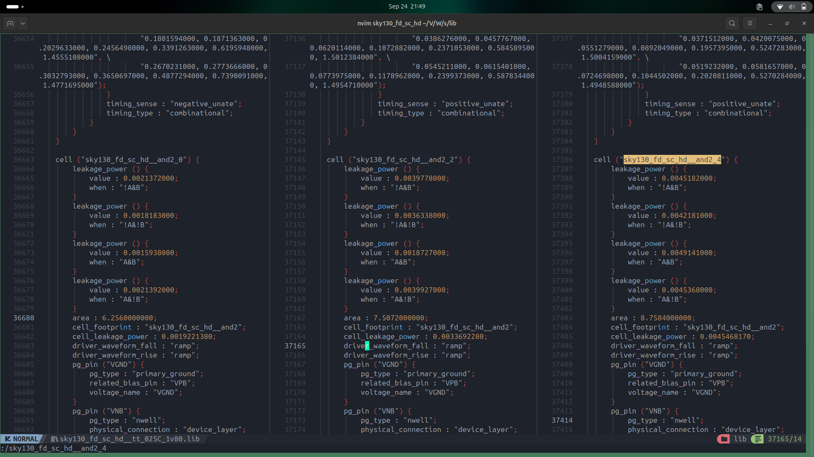
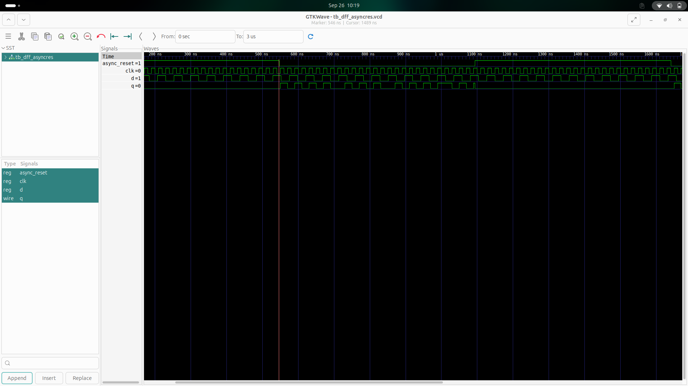

# Day 2 – Timing Libraries, Hierarchical vs Flat Synthesis, and Efficient Flop Coding Styles

---

## 📑 Table of Contents
1. [Introduction to Timing .libs](#1-introduction-to-timing-libs)  
2. [Hierarchical vs Flat Synthesis](#2-hierarchical-vs-flat-synthesis)  
3. [Various Flop Coding Styles and Optimization](#3-various-flop-coding-styles-and-optimization)  
4. [Interesting Optimization Techniques](#4-interesting-optimization-techniques)  

---

## 1. Introduction to Timing .libs  

The **`.lib` files** (timing libraries) define the characteristics of standard cells used in synthesis, placement, and timing analysis.  
These libraries contain **multiple cells with the same logic function** but **different specifications** — optimized for different **power, voltage, and temperature (PVT) conditions**.  

Fabrication is like a recipe to create billions of transistors on a single chip. With 14+ layers of nanometer-scale processing, every variant has its own leakage, delay, and area trade-offs.  

We can choose the appropriate cell/library according to the design requirements.

---

### 📷 Example: Power vs Leakage
  
*Different combinations of inputs and PVT variations lead to different leakage and power consumption.*  

  
*Same AND gate implemented with varying area trade-offs.*  

---

### 🔎 Decoding a SKY130 Library Name
Example: **`tt_025C_1v80`**

- **tt** → Typical process corner  
- **025C** → Temperature = 25 °C  
- **1v80** → Core voltage = 1.8 V  

This naming convention specifies the **process, voltage, and temperature conditions** modeled in the library.

---

## 2. Hierarchical vs Flat Synthesis  

Synthesis can be done **hierarchically** or **flat**, and the choice directly impacts **optimization, compilation time, and debugging**.

---

### 🔹 Hierarchical Synthesis  

In **hierarchical synthesis**, each module is synthesized independently, preserving HDL hierarchy.  

**Key Characteristics**  
- ✅ Preserves modular design structure  
- ✅ Faster compilation (incremental changes)  
- ✅ Easier debugging and signal tracing  
- ✅ Best suited for **large, multi-person projects**  

  

---

### 🔹 Flat Synthesis  

In **flat synthesis**, the hierarchy is dissolved into one large module for global optimization.  

**Key Characteristics**  
- ✅ Enables **global optimization** across entire design  
- ❌ Slower compilation (entire design re-synthesized)  
- ❌ Harder debugging (loss of hierarchy)  
- ✅ Good for **smaller or performance-critical designs**  

  

---

### 📊 Comparison Summary  

| Feature              | Hierarchical Synthesis                     | Flat Synthesis                                  |
|----------------------|---------------------------------------------|------------------------------------------------|
| **Design Structure** | Preserves module hierarchy                  | Dissolves into single module                   |
| **Optimization**     | Local to each module                       | Global across the entire design                |
| **Compilation Time** | Faster (incremental changes supported)      | Slower (entire design recompiled)              |
| **Debugging**        | Easier, maps directly to HDL code           | Harder, difficult to trace back to HDL         |
| **Large Designs**    | Manageable and scalable                     | Can become resource-heavy                      |
| **Predictability**   | More predictable timing & area per module   | Less predictable, tool freedom may vary result |

---

## 3. Various Flop Coding Styles and Optimization  

Flip-flops (**flops**) are essential for:  
1. ✅ Removing glitches for stable output  
2. ✅ Synchronizing circuits  

---

### 🔹 Asynchronous Reset Flop  

```verilog
module dff_asyncres (
  input clk, 
  input async_reset, 
  input d, 
  output reg q
);
  always @ (posedge clk, posedge async_reset)
    if (async_reset)
      q <= 1'b0;
    else
      q <= d;
endmodule
```

#### 📷 Waveform:

#### 📷 Synthesis Output:


### 🔹 synchronus reset
```verilog
module dff_syncres (input clk, input async_reset, input sync_reset, input d, output reg q);
  always @ (posedge clk)
    if (sync_reset)
      q <= 1'b0;
    else
      q <= d;
endmodule
```
#### 📷 Waveform:

#### 📷 Synthesis Output:


## 4. Interesting Optimization Techniques

Optimizations in HDL often come from replacing costly arithmetic operations with cheaper logical shifts.

🔹 Multiply/Divide by 2

- Multiplication by 2 = Left shift by 1
- Division by 2 = Right shift by 1
#### 📷 Cell and Result:
   
   
   
🔹 Example: Multiply by 9 (3-bit input a[2:0])

Instead of costly multiplication, replicate bits to form result aa.

#### 📷 Cell and Result:
   
   
   
✅ Summary

- .libs describe cell timing, power, and PVT variations.
- Hierarchical synthesis is modular, faster for incremental changes, and easier to debug.
- Flat synthesis provides global optimization but at the cost of compilation time and debug complexity.
- Efficient flop coding ensures stability and synchronization, with reset strategy tailored to design.
- Optimization tricks (like replacing multipliers with shifts) help save area and improve performance.

