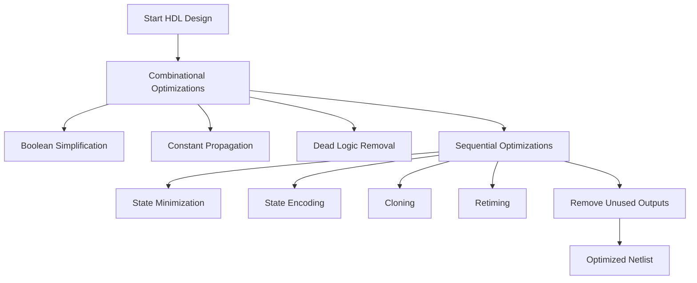

# Day 3 – Combinational and Sequential Optimizations  

---

## 📑 Table of Contents  
1. [Introduction to Optimizations](#1-introduction-to-optimizations)  
2. [Combinational Logic Optimizations](#2-combinational-logic-optimizations)  
3. [Sequential Logic Optimizations](#3-sequential-logic-optimizations)  
4. [Sequential Optimizations for Unused Outputs](#4-sequential-optimizations-for-unused-outputs)  

---

## 1. Introduction to Optimizations  

Optimization in digital circuits refers to **improving area, delay, and power** without altering the functionality.  
This is done using:  

- **Boolean algebra simplification** (K-map, algebraic laws)  
- **Redundancy removal** (unnecessary gates or signals)  
- **Logic restructuring** (rearranging equations for better performance)  
- **Sequential restructuring** (moving or cloning registers for better timing balance)  

🔑 **Goal:** Reduce silicon area, improve speed, and lower power consumption.  

---

## 2. Combinational Logic Optimizations  

Techniques applied to purely **combinational circuits**:  

- **Boolean simplification**  
  Example:  
y = a·b + a·b' → y = a
- **Common sub-expression elimination**  
If multiple expressions share the same logic, compute it once and reuse it.  
- **Constant propagation**  
Replace inputs with known constants at compile-time.  
y = a & 1 → y = a
y = b | 0 → y = b
- **Dead logic elimination**  
Gates that never affect the output are removed.  

---

## 3. Sequential Logic Optimizations  

Sequential circuits introduce **flip-flops and state machines**. Optimizations include:  

### 🔹 State Minimization  
- Remove redundant states in an FSM.  
- Merge equivalent states that produce the same outputs and transitions.  

### 🔹 State Encoding Optimization  
- One-hot, Gray, or binary encoding chosen depending on **speed vs area trade-off**.  

### 🔹 Retiming  
- Move registers across combinational logic to **balance delays** and improve timing.  

### 🔹 Cloning  
- Duplicate a register close to multiple fan-out paths to **reduce load** and improve timing closure.  

---

## 4. Sequential Optimizations for Unused Outputs  

When a register’s output is **never observed** (unused in final circuit), synthesis tools:  

- **Remove those flops** automatically.  
- Replace with constant values (0 or 1).  
- Reduce power and area by eliminating unnecessary storage elements.  

This process is called **register pruning**.  

---

## 📊 Flowchart of Optimizations  

