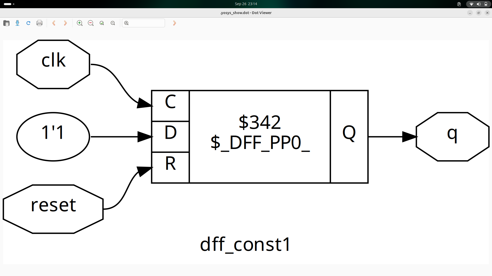

# Day 3 – Combinational and Sequential Optimizations  

---

## 📑 Table of Contents  
1. [Introduction to Optimizations](#1-introduction-to-optimizations)  
2. [Combinational Logic Optimizations](#2-combinational-logic-optimizations)  
3. [Sequential Logic Optimizations](#3-sequential-logic-optimizations)  
4. [Sequential Optimizations for Unused Outputs](#4-sequential-optimizations-for-unused-outputs)  

---

## 1. Introduction to Optimizations  

Optimization in digital circuits refers to **improving area, delay, and power** without altering the functionality.  
This is done using:  

- **Boolean algebra simplification** (K-map, algebraic laws)  
- **Redundancy removal** (unnecessary gates or signals)  
- **Logic restructuring** (rearranging equations for better performance)  
- **Sequential restructuring** (moving or cloning registers for better timing balance)  

🔑 **Goal:** Reduce silicon area, improve speed, and lower power consumption.  

---

## 2. Combinational Logic Optimizations  

Techniques applied to purely **combinational circuits**:  

- **Boolean simplification**  
  Example:  
y = a·b + a·b' → y = a
- **Common sub-expression elimination**  
If multiple expressions share the same logic, compute it once and reuse it.  
- **Constant propagation**  
Replace inputs with known constants at compile-time.  
y = a & 1 → y = a
y = b | 0 → y = b
- **Dead logic elimination**  
Gates that never affect the output are removed.  

---
Below are small Verilog examples that illustrate how **optimizations simplify circuits**.  

---

### 🔹 Lab 1 – Ternary Reduction
```verilog
module opt_check (input a , input b , output y);
	assign y = a?b:0;
endmodule
```
Optimization:

- Expression → y = a & b

📉 Reduced from MUX (2-to-1) to single AND gate.


### 🔹 Lab 2 – Constant Simplification
```verilog
module opt_check2 (input a , input b , output y);
	assign y = a?1:b;
endmodule
```
Optimization:

- Expression → y = a | b

📉 Reduced from MUX to OR gate.


### 🔹 Lab 3 – Nested Conditions
```verilog
module opt_check3 (input a , input b, input c , output y);
	assign y = a?(c?b:0):0;
endmodule
```
Optimization:

- Expression → y = a & c & b

📉 Reduced from nested MUX tree to AND gate chain.


### 🔹 Lab 4 – Complex Expression
```verilog
module opt_check4 (input a , input b , input c , output y);
 assign y = a?(b?(a & c ):c):(!c);
 endmodule
```
Optimization:

- Simplifies to → y = (a & b & c) | (!a & !c) | (a & !b & c)
- Yosys further reduces depending on conditions.

📉 From 4-level nested logic → minimal SOP form.

### 🔹 Lab 5 – Multiple Submodules (with Redundant Logic)
```verilog
module sub_module1(input a , input b , output y);
 assign y = a & b;
endmodule

module sub_module2(input a , input b , output y);
 assign y = a^b;
endmodule

module multiple_module_opt(input a , input b , input c , input d , output y);
wire n1,n2,n3;

sub_module1 U1 (.a(a) , .b(1'b1) , .y(n1));
sub_module2 U2 (.a(n1), .b(1'b0) , .y(n2));
sub_module2 U3 (.a(b), .b(d) , .y(n3));

assign y = c | (b & n1); 

endmodule
```
Optimization:

- n1 = a & 1 → a
- n2 = a ^ 0 → a
- Final → y = c | (a & b)

📉 Multiple submodules collapsed into single OR-AND expression.


### 🔹 Lab 6 – Multiple Submodules (with Optimizable Nets)

```verilog

module sub_module(input a , input b , output y);
 assign y = a & b;
endmodule


module multiple_module_opt2(input a , input b , input c , input d , output y);
wire n1,n2,n3;

sub_module U1 (.a(a) , .b(1'b0) , .y(n1));
sub_module U2 (.a(b), .b(c) , .y(n2));
sub_module U3 (.a(n2), .b(d) , .y(n3));
sub_module U4 (.a(n3), .b(n1) , .y(y));


endmodule
```
Optimization:

- n1 = a & 0 → 0
- y = n3 & 0 → 0

📉 Whole module reduces to constant 0.


## 3. Sequential Logic Optimizations  

Sequential circuits introduce **flip-flops and state machines**. Optimizations include:  

### 🔹 State Minimization  
- Remove redundant states in an FSM.  
- Merge equivalent states that produce the same outputs and transitions.  

### 🔹 State Encoding Optimization  
- One-hot, Gray, or binary encoding chosen depending on **speed vs area trade-off**.  

### 🔹 Retiming  
- Move registers across combinational logic to **balance delays** and improve timing.  

### 🔹 Cloning  
- Duplicate a register close to multiple fan-out paths to **reduce load** and improve timing closure.

### Lab 7: Flip-Flop with a Constant High Input

```verilog
module dff_const1(input clk, input reset, output reg q);
always @(posedge clk, posedge reset)
begin
	if(reset)
		q <= 1'b0;
	else
		q <= 1'b1;
end

endmodule
```
- Optimization: Synthesizes to a single D-flip-flop with its D-input tied high (VCC), as the data is always 1 after reset.


### Lab 8: Redundant Flip-Flop Optimized to a Constant
```verilog
module dff_const2(input clk, input reset, output reg q);
always @(posedge clk, posedge reset)
begin
	if(reset)
		q <= 1'b1;
	else
		q <= 1'b1;
end

endmodule
```
- Optimization: The flip-flop is completely removed. The tool sees the output is always 1 and ties the output q directly to VCC.


### Lab 9: 2-Bit Shift Register with Asynchronous Set/Reset

```verilog
module dff_const3(input clk, input reset, output reg q);
reg q1;

always @(posedge clk, posedge reset)
begin
	if(reset)
	begin
		q <= 1'b1;
		q1 <= 1'b0;
	end
	else
	begin
		q1 <= 1'b1;
		q <= q1;
	end
end

endmodule
```
- Optimization: Implements a 2-flop shift register. q1's input is tied high, and q's input is fed by q1's output. The reset values are set accordingly.


### Lab 10: Redundant 2-Stage Logic Optimized Away
```verilog
module dff_const4(input clk, input reset, output reg q);
reg q1;

always @(posedge clk, posedge reset)
begin
	if(reset)
	begin
		q <= 1'b1;
		q1 <= 1'b1;
	end
	else
	begin
		q1 <= 1'b1;
		q <= q1;
	end
end

endmodule
```
- Optimization: All sequential logic is removed. The tool determines the output q is always 1 and ties it directly to VCC.


### Lab 11: Standard 2-Bit Shift Register with Constant Input
```
module dff_const5(input clk, input reset, output reg q);
reg q1;

always @(posedge clk, posedge reset)
begin
	if(reset)
	begin
		q <= 1'b0;
		q1 <= 1'b0;
	end
	else
	begin
		q1 <= 1'b1;
		q <= q1;
	end
end

endmodule
```
- Optimization: Creates a simple 2-bit shift register with a constant 1 being shifted in. Both flops are reset to 0.


---

## 4. Sequential Optimizations for Unused Outputs  

When a register’s output is **never observed** (unused in final circuit), synthesis tools:  

- **Remove those flops** automatically.  
- Replace with constant values (0 or 1).  
- Reduce power and area by eliminating unnecessary storage elements.  

This process is called **register pruning**.  

### Lab 12: Counter Pruning for a Single-Bit Output
```verilog
module counter_opt (input clk , input reset , output q);
reg [2:0] count;
assign q = count[0];

always @(posedge clk ,posedge reset)
begin
	if(reset)
		count <= 3'b000;
	else
		count <= count + 1;
end

endmodule
```
#### Optimization Analysis ⚙️
The synthesis tool detects that the upper two bits, count[2] and count[1], have no impact on the output q. These "un-used" flip-flops are pruned (removed). Since count[0] simply toggles every clock cycle (0, 1, 0, 1...), the entire 3-bit counter is optimized down to a single toggle flip-flop.


### Lab 13: Counter with Full-Width State Decoder
```verilog
module counter_opt (input clk , input reset , output q);
reg [2:0] count;
assign q = (count[2:0] == 3'b100);

always @(posedge clk ,posedge reset)
begin
	if(reset)
		count <= 3'b000;
	else
		count <= count + 1;
end

endmodule
```
#### Optimization Analysis ⚙️
In this case, all three bits (count[2], count[1], and count[0]) are required to evaluate the condition (count == 3'b100). Because all bits are used by the comparator logic, no registers can be pruned. The tool synthesizes the full 3-bit counter along with the necessary combinational logic (a decoder) to detect the specific value.


---

## 📊 Flowchart of Optimizations  


## 🧹 `opt_clean -purge` in Yosys

The `opt_clean` pass in **Yosys** removes unused cells and wires after optimizations.  
By default, it cleans **dangling wires and cells** that no longer affect the design.

- **Basic `opt_clean`**  
  Removes cells and wires that have no fanout or are otherwise unused.

- **With `-purge` option**  
  The `-purge` flag goes further:  
  - It removes *all* unused wires (even module inputs/outputs if unconnected).  
  - It deletes constant drivers, buffers, and any redundant connections.  
  - Ensures the design has **no leftover logic** after optimizations.

### 🔑 Usage
```tcl
opt_clean -purge
```


