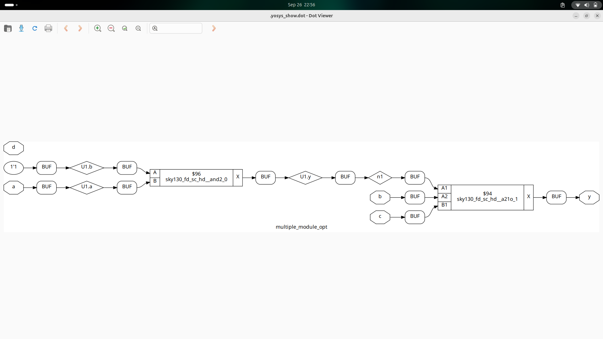

# Day 3 – Combinational and Sequential Optimizations  

---

## 📑 Table of Contents  
1. [Introduction to Optimizations](#1-introduction-to-optimizations)  
2. [Combinational Logic Optimizations](#2-combinational-logic-optimizations)  
3. [Sequential Logic Optimizations](#3-sequential-logic-optimizations)  
4. [Sequential Optimizations for Unused Outputs](#4-sequential-optimizations-for-unused-outputs)  

---

## 1. Introduction to Optimizations  

Optimization in digital circuits refers to **improving area, delay, and power** without altering the functionality.  
This is done using:  

- **Boolean algebra simplification** (K-map, algebraic laws)  
- **Redundancy removal** (unnecessary gates or signals)  
- **Logic restructuring** (rearranging equations for better performance)  
- **Sequential restructuring** (moving or cloning registers for better timing balance)  

🔑 **Goal:** Reduce silicon area, improve speed, and lower power consumption.  

---

## 2. Combinational Logic Optimizations  

Techniques applied to purely **combinational circuits**:  

- **Boolean simplification**  
  Example:  
y = a·b + a·b' → y = a
- **Common sub-expression elimination**  
If multiple expressions share the same logic, compute it once and reuse it.  
- **Constant propagation**  
Replace inputs with known constants at compile-time.  
y = a & 1 → y = a
y = b | 0 → y = b
- **Dead logic elimination**  
Gates that never affect the output are removed.  

---
Labs : 
```verilog
module opt_check (input a , input b , output y);
	assign y = a?b:0;
endmodule
```

```verilog
module opt_check2 (input a , input b , output y);
	assign y = a?1:b;
endmodule
```

```verilog
module opt_check3 (input a , input b, input c , output y);
	assign y = a?(c?b:0):0;
endmodule
```

```verilog
module opt_check4 (input a , input b , input c , output y);
 assign y = a?(b?(a & c ):c):(!c);
 endmodule
```

```verilog
module sub_module1(input a , input b , output y);
 assign y = a & b;
endmodule

module sub_module2(input a , input b , output y);
 assign y = a^b;
endmodule

module multiple_module_opt(input a , input b , input c , input d , output y);
wire n1,n2,n3;

sub_module1 U1 (.a(a) , .b(1'b1) , .y(n1));
sub_module2 U2 (.a(n1), .b(1'b0) , .y(n2));
sub_module2 U3 (.a(b), .b(d) , .y(n3));

assign y = c | (b & n1); 

endmodule
```

```verilog

module sub_module(input a , input b , output y);
 assign y = a & b;
endmodule


module multiple_module_opt2(input a , input b , input c , input d , output y);
wire n1,n2,n3;

sub_module U1 (.a(a) , .b(1'b0) , .y(n1));
sub_module U2 (.a(b), .b(c) , .y(n2));
sub_module U3 (.a(n2), .b(d) , .y(n3));
sub_module U4 (.a(n3), .b(n1) , .y(y));


endmodule
```


## 3. Sequential Logic Optimizations  

Sequential circuits introduce **flip-flops and state machines**. Optimizations include:  

### 🔹 State Minimization  
- Remove redundant states in an FSM.  
- Merge equivalent states that produce the same outputs and transitions.  

### 🔹 State Encoding Optimization  
- One-hot, Gray, or binary encoding chosen depending on **speed vs area trade-off**.  

### 🔹 Retiming  
- Move registers across combinational logic to **balance delays** and improve timing.  

### 🔹 Cloning  
- Duplicate a register close to multiple fan-out paths to **reduce load** and improve timing closure.  

---

## 4. Sequential Optimizations for Unused Outputs  

When a register’s output is **never observed** (unused in final circuit), synthesis tools:  

- **Remove those flops** automatically.  
- Replace with constant values (0 or 1).  
- Reduce power and area by eliminating unnecessary storage elements.  

This process is called **register pruning**.  

---

## 📊 Flowchart of Optimizations  


## 🧹 `opt_clean -purge` in Yosys

The `opt_clean` pass in **Yosys** removes unused cells and wires after optimizations.  
By default, it cleans **dangling wires and cells** that no longer affect the design.

- **Basic `opt_clean`**  
  Removes cells and wires that have no fanout or are otherwise unused.

- **With `-purge` option**  
  The `-purge` flag goes further:  
  - It removes *all* unused wires (even module inputs/outputs if unconnected).  
  - It deletes constant drivers, buffers, and any redundant connections.  
  - Ensures the design has **no leftover logic** after optimizations.

### 🔑 Usage
```tcl
opt_clean -purge
```

