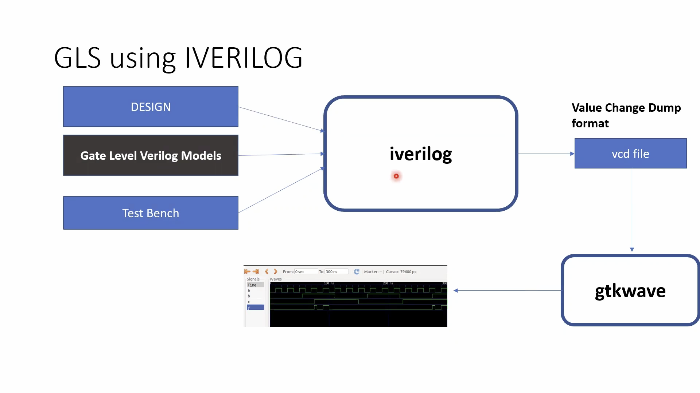
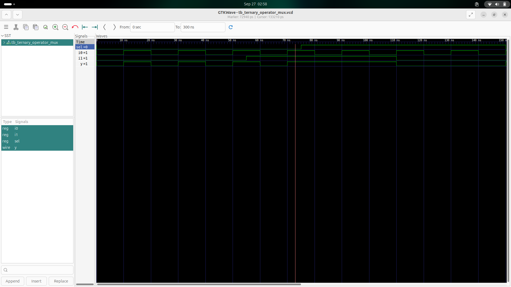
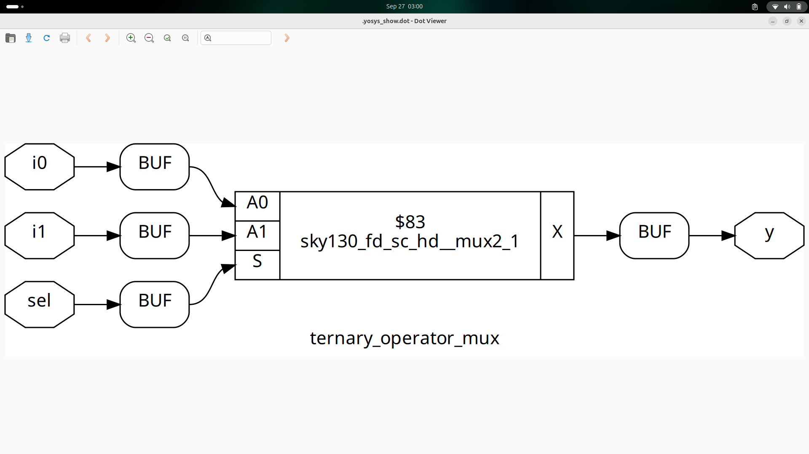
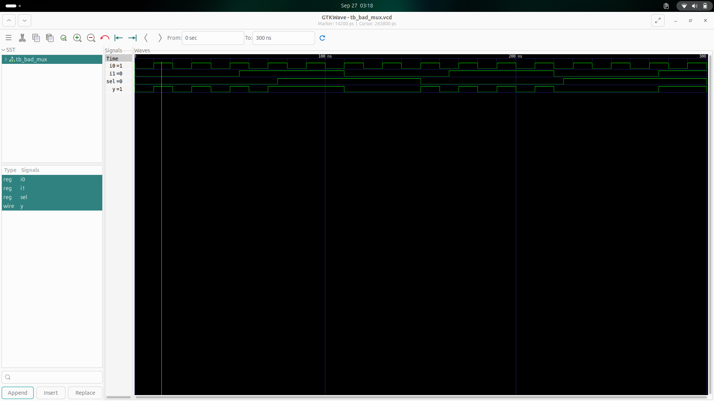

Day 4 - GLS, blocking vs non-blocking and Synthesis-Simulation mismatch

TOC

GLS, Synthesis-Simulation mismatch and Blocking/Non-blocking statements

Labs on GLS and Synthesis-Simulation Mismatch

Labs on synth-sim mismatch for blocking statement

1. GLS, Synthesis-Simulation mismatch and Blocking/Non-blocking statements

What is GLS ? 
Why GLS?

SynthesisSimulationMismatch
Missing sensitivity list
caveates with Blocking statements


2. Labs on GLS and Synthesis-Simulation Mismatch

how to get GLS ? by yosys genrate netlist and the simlate with same testbench

In Yosys, the -noattr option is used with the write_verilog command to create a cleaner output netlist.

It removes all synthesis attributes (like (* keep *), (* full_case *), etc.) from the generated Verilog file.

Why use it?

To produce a cleaner, more readable netlist.

To improve compatibility with downstream tools that might not understand Yosys-specific attributes.

Example:

```Tcl

# Writes the netlist without any attributes
write_verilog -noattr synthesized_design.v
```
Labs : 

ternary operator




bad mux having code 
```verilog
module bad_mux (input i0 , input i1 , input sel , output reg y);
always @ (sel)
begin
	if(sel)
		y <= i1;
	else 
		y <= i0;
end
endmodule
```




3. Labs on synth-sim mismatch for blocking statement
blocking caveat
code :
```verilog
module blocking_caveat (input a , input b , input  c, output reg d); 
reg x;
always @ (*)
begin
	d = x & c;
	x = a | b;
end
endmodule
```
explainination


