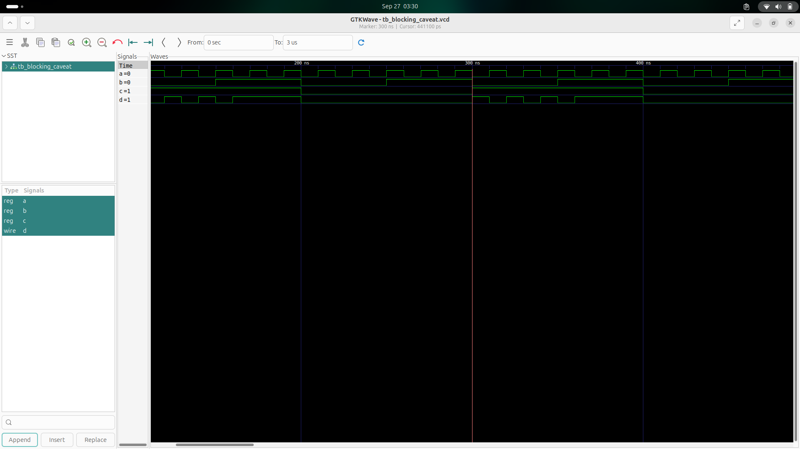
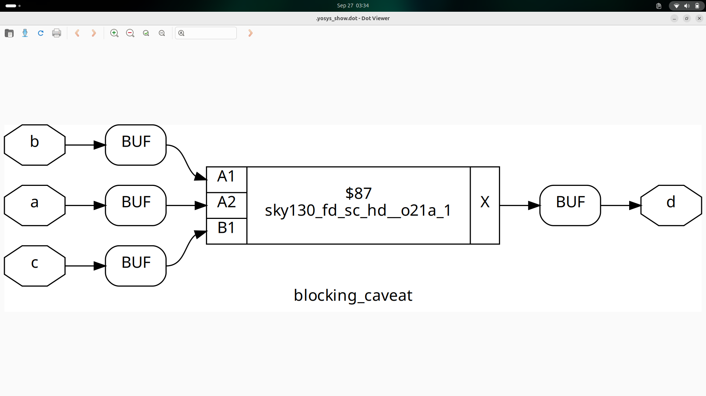
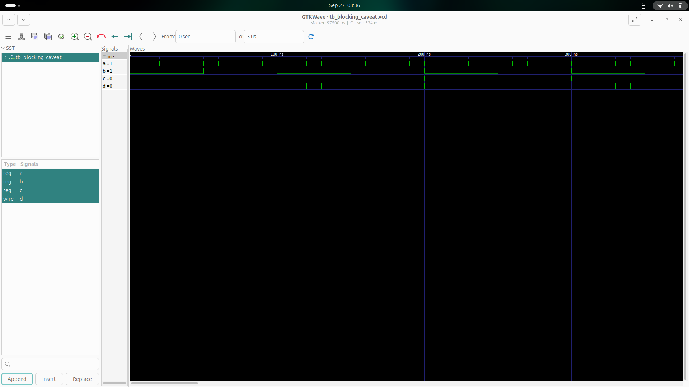

# 🧠 Day 4 - GLS, Blocking vs Non-blocking, and Synthesis-Simulation Mismatch

---

## 📚 Table of Contents

1. [GLS, Synthesis-Simulation Mismatch, and Blocking/Non-blocking Statements](#1-gls-synthesis-simulation-mismatch-and-blockingnon-blocking-statements)  
2. [Labs on GLS and Synthesis-Simulation Mismatch](#2-labs-on-gls-and-synthesis-simulation-mismatch)  
3. [Labs on Synth-Sim Mismatch for Blocking Statement](#3-labs-on-synth-sim-mismatch-for-blocking-statement)

---

## 1. GLS, Synthesis-Simulation Mismatch and Blocking/Non-blocking Statements

### 🔍 What is GLS?

**GLS** stands for **Gate-Level Simulation**.

It is a form of simulation that uses the **gate-level netlist** (typically post-synthesis or post-layout) instead of RTL.

### ✅ Why GLS?

- To **verify** the design functionality after synthesis.
- To catch mismatches between **RTL simulation** and **synthesized netlist**.
- To ensure **timing correctness** (especially in post-layout GLS with SDF).
  


---

### ⚠️ Synthesis-Simulation Mismatch

Common causes of mismatches between RTL and synthesized netlist simulations:

- **Missing sensitivity list** in combinational logic.
- **Incorrect use of blocking (`=`) vs non-blocking (`<=`)** assignments.
- **Unintended latch inference** or synthesis pruning.

---

### 🔁 Caveats with Blocking Statements

Improper use of **blocking assignments** can lead to **synth-sim mismatches**, especially in combinational blocks.

Use **non-blocking** (`<=`) for sequential logic and **blocking** (`=`) with care in combinational logic.

---

## 2. 🧪 Labs on GLS and Synthesis-Simulation Mismatch

### 💡 How to get GLS?

Use **Yosys** to generate a netlist, and simulate it with the **same testbench** used for RTL.

#### 📦 Yosys Tip:

To create a cleaner, more readable netlist, use the `-noattr` option:

```tcl
write_verilog -noattr synthesized_design.v
```
- This removes all synthesis attributes like (* keep *), (* full_case *), etc.
- Improves readability and downstream compatibility.


### ✅ Ternary Operator Example
#### RTL Simulation:


#### Synthesized Netlist:


#### GLS Waveform:


### ❌ Bad Mux Example

```verilog
module bad_mux (input i0 , input i1 , input sel , output reg y);
always @ (sel)
begin
	if(sel)
		y <= i1;
	else 
		y <= i0;
end
endmodule
```
#### RTL Simulation:


#### GLS:


#### Issue:
Incorrect sensitivity list! always @ (sel) ignores changes to i0 and i1.

---

## 3. ⚠️ Labs on Synth-Sim Mismatch for Blocking Statement

### 🔁 Blocking Caveat Example
```verilog
module blocking_caveat (input a , input b , input  c, output reg d); 
reg x;
always @ (*)
begin
	d = x & c;
	x = a | b;
end
endmodule
```
### 💡 Explanation:

In this code:

- d is calculated before x is updated.

- In simulation, this executes sequentially and might give wrong results.

- But synthesis tools optimize it differently, possibly creating a mismatch.

#### RTL Simulation:


#### Netlist View:


#### GLS Result:


## ✅ Summary

| Concept               | Correct Practice                     | Potential Issue                      |
|-----------------------|--------------------------------------|--------------------------------------|
| Sensitivity list      | Use `always @(*)` for combinational logic | Missing signals can cause mismatches |
| Blocking vs Non-blocking | Use `=` in comb, `<=` in seq         | Blocking order matters               |
| GLS                   | Run after synthesis to verify correctness | Can expose mismatches                |


💡 Always verify your design at both RTL and gate level to catch synthesis-related issues early.


