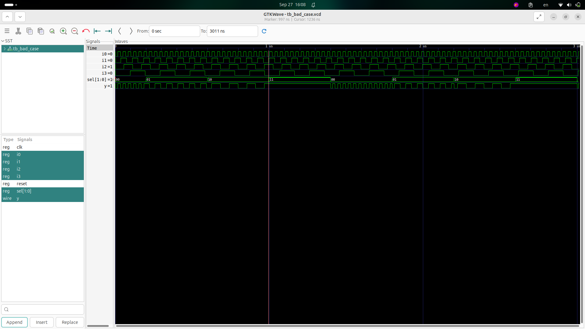

# Day 5 - Optimization in Synthesis

## Table of Contents
1. If-Case Constructs
2. Labs on "Incomplete If Case"
3. Labs on "Incomplete Overlapping Case"
4. For Loop and For Generate
5. Labs on "For Loop" and "For Generate"

---

## 1. If-Case Constructs

### If and Case Statements
- **If Statements**: Used for priority-based decisions.
- **Case Statements**: Used when multiple mutually exclusive conditions exist.

### Usage
- Use **if** when one condition has higher priority.
- Use **case** when multiple exclusive conditions need to be checked.

### Issues
- **Incomplete if** or **incomplete case** statements can infer **latches**.
- **If without else**: May cause unexpected latch inference.
- **Case without default**: May leave signals unassigned for some inputs.

### Example: Counter
If we make a counter using incomplete if:
- Without `else`, output is not defined in all conditions → **Latch inferred**.

---

## 2. Labs on "Incomplete If Case"

### Example 1: Incomplete If
```verilog
module incomp_if (input i0 , input i1 , input i2 , output reg y);
always @ (*)
begin
    if(i0)
        y <= i1;
end
endmodule
```

**Problem**: Missing `else` branch → `y` retains value when `i0=0` → Latch inferred.

**Final Boolean Function**:  
`y = (i0) ? i1 : y_previous`

**Waveform**:  


**Synthesized Netlist**:  


---

### Example 2: If with Else-if
```verilog
module incomp_if2 (input i0 , input i1 , input i2 , input i3, output reg y);
always @ (*)
begin
    if(i0)
        y <= i1;
    else if (i2)
        y <= i3;
end
endmodule
```

**Problem**: Missing final `else` → `y` undefined if neither `i0` nor `i2` is high → Latch inferred.

**Final Boolean Function**:  
`y = (i0) ? i1 : (i2 ? i3 : y_previous)`

**Waveform**:  


**Synthesized Netlist**:  


---

## 3. Labs on "Incomplete Overlapping Case"

### Example 1: Incomplete Case
```verilog
module incomp_case (input i0 , input i1 , input i2 , input [1:0] sel, output reg y);
always @ (*)
begin
    case(sel)
        2'b00 : y = i0;
        2'b01 : y = i1;
    endcase
end
endmodule
```

**Problem**: No assignment for `sel = 2'b10` or `2'b11` → Latch inferred.

**Final Boolean Function**:  
`y = (sel==2'b00)?i0 : (sel==2'b01)?i1 : y_previous`

**Waveform**:  


**Synthesized Netlist**:  


---

### Example 2: Complete Case with Default
```verilog
module comp_case (input i0 , input i1 , input i2 , input [1:0] sel, output reg y);
always @ (*)
begin
    case(sel)
        2'b00 : y = i0;
        2'b01 : y = i1;
        default : y = i2;
    endcase
end
endmodule
```

**Solution**: Default covers missing cases → No latch inference.

**Final Boolean Function**:  
`y = (sel==2'b00)?i0 : (sel==2'b01)?i1 : i2`

**Waveform**:  


**Synthesized Netlist**:  


---

### Example 3: Partial Assignments in Case
```verilog
module partial_case_assign (input i0 , input i1 , input i2 , input [1:0] sel, output reg y , output reg x);
always @ (*)
begin
    case(sel)
        2'b00 : begin
            y = i0;
            x = i2;
        end
        2'b01 : y = i1;
        default : begin
            x = i1;
            y = i2;
        end
    endcase
end
endmodule
```

**Problem**: For `sel=01`, `x` is not assigned → Latch inferred.

**Final Boolean Function**:  
- `y = (sel==2'b00)?i0 : (sel==2'b01)?i1 : i2`  
- `x = (sel==2'b00)?i2 : (sel==2'b01)?x_previous : i1`

**Waveform**:  


**Synthesized Netlist**:  


---

### Example 4: Bad Case (Overlapping Case)
```verilog
module bad_case (
    input i0,
    input i1,
    input i2,
    input i3,
    input [1:0] sel,
    output reg y
);
  always @(*) begin
    case (sel)
      2'b00: y = i0;
      2'b01: y = i1;
      2'b10: y = i2;
      2'b1?: y = i3;
     // 2'b11: y = i3;
    endcase
  end
endmodule
```

**Problem**: Overlapping patterns (`2'b1?` includes `2'b10` and `2'b11`) → Ambiguity in synthesis.

**Final Boolean Function**:  
`y = (sel==2'b00)?i0 : (sel==2'b01)?i1 : (sel==2'b10)?i2 : i3`

**Waveform**:  


**Synthesized Netlist**:  


**GLS Simulation**:  


---

## 4. For Loop and For Generate
- **For Loop**: Used in testbenches and behavioral RTL for repetitive tasks.
- **For Generate**: Used for structural replication of hardware modules.
How to use??
Advantages ??
usecase:
mux
demux
ripple carry adder

---

## 5. Labs on For Loop and For Generate
(Examples to be added in practical session.)

