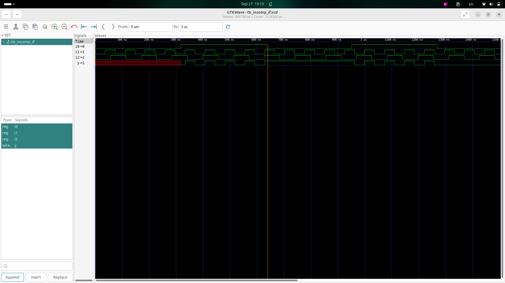
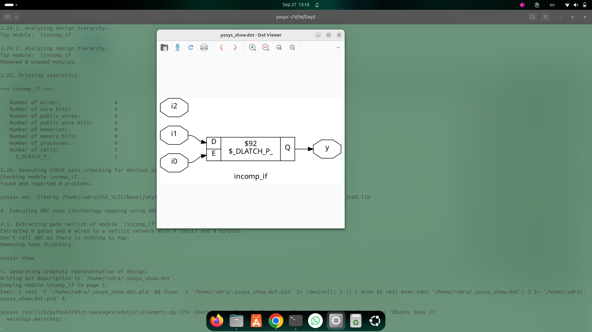
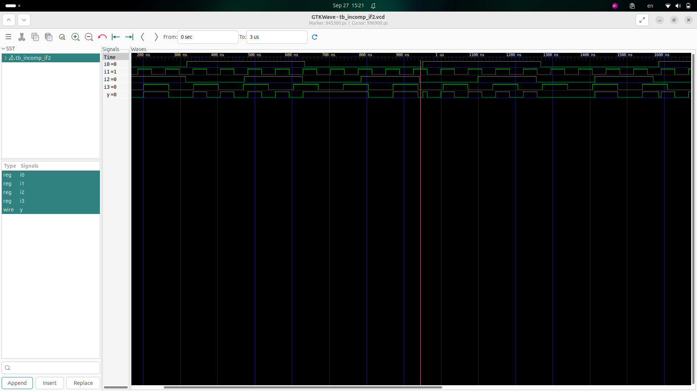
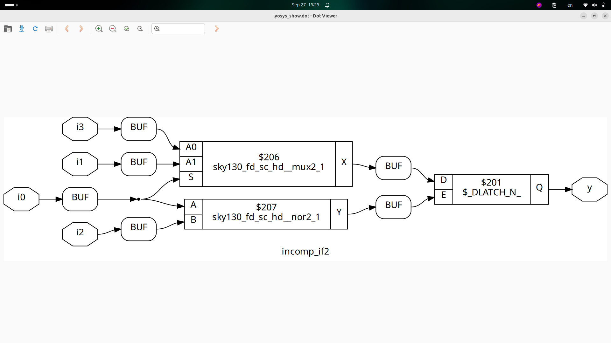
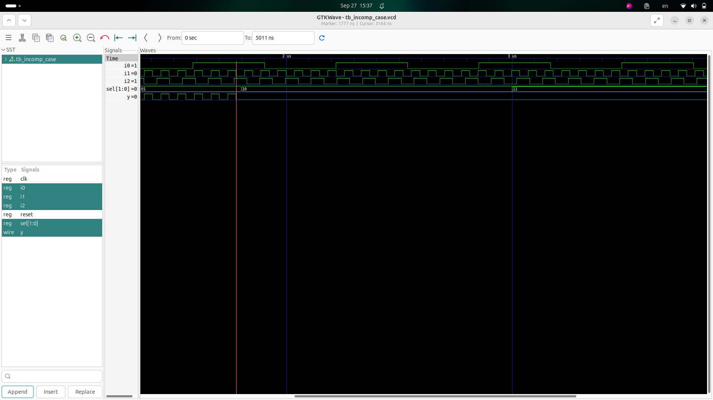
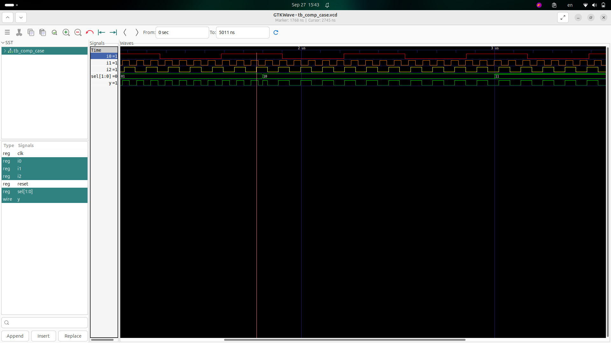
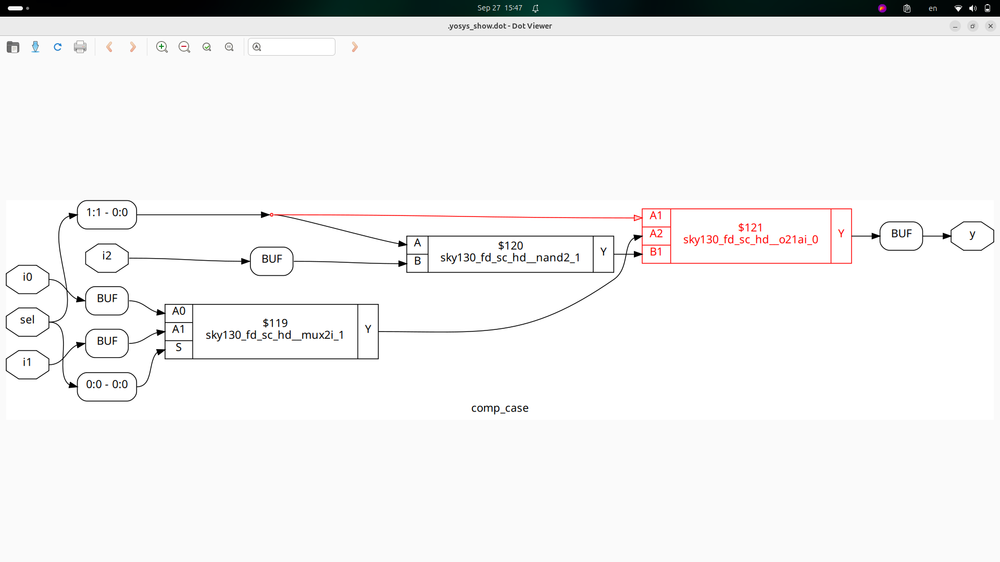
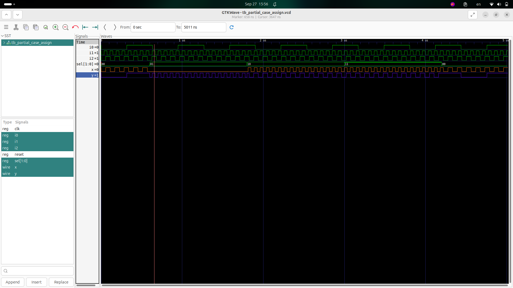
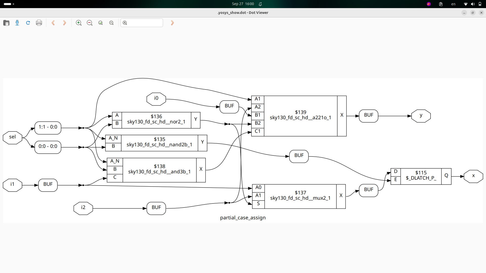

Day 5 - Optimization in synthesis

TOC

If Case constructs

Labs on "Incomplete If Case"

Labs on "Incomplete overlapping Case"

for loop and for generate

Labs on "for loop" and "for generate"

1. If Case constructs

If and case statement

how to use where to use

incomplete if and case statements

inffered latch

if without else
if we make counter. it needs

in case no overlaping cases.

2. Labs on "Incomplete If Case"
incomplete if
```verilog
module incomp_if (input i0 , input i1 , input i2 , output reg y);
always @ (*)
begin
	if(i0)
		y <= i1;
end
endmodule
```
discuss problem in short add final boolean function.
waveform:

synthsized netlist:


```verilog
module incomp_if2 (input i0 , input i1 , input i2 , input i3, output reg y);
always @ (*)
begin
	if(i0)
		y <= i1;
	else if (i2)
		y <= i3;

end
endmodule
```
discuss problem in short and add final boolean function.
waveform:

synthsized netlist:


3. Labs on "Incomplete overlapping Case"incomplete case:

```verilog

module incomp_case (input i0 , input i1 , input i2 , input [1:0] sel, output reg y);
always @ (*)
begin
	case(sel)
		2'b00 : y = i0;
		2'b01 : y = i1;
	endcase
end
endmodule
```
discuss problem in short and add final boolean function.
waveform:

synthsized netlist:


```verilog
module comp_case (input i0 , input i1 , input i2 , input [1:0] sel, output reg y);
always @ (*)
begin
	case(sel)
		2'b00 : y = i0;
		2'b01 : y = i1;
		default : y = i2;
	endcase
end
endmodule
```
discuss problem in short and add final boolean function.
waveform:

synthsized netlist:


```verilog
module partial_case_assign (input i0 , input i1 , input i2 , input [1:0] sel, output reg y , output reg x);
always @ (*)
begin
	case(sel)
		2'b00 : begin
			y = i0;
			x = i2;
			end
		2'b01 : y = i1;
		default : begin
		           x = i1;
			   y = i2;
			  end
	endcase
end
endmodule
```
discuss problem in short and add final boolean function.
waveform:

synthsized netlist:
d


