# Day 5 - Optimization in Synthesis

## Table of Contents
[1. If-Case Constructs](#1-If-case-constructs)
[2. Labs on "Incomplete If Case"](2-Labs-on-"Incomplete-If-Case")
[3. Labs on "Incomplete Overlapping Case"](3-Labs-on-"Incomplete-Overlapping-Case")
[4. For Loop and For Generate](4-For-Loop-and-For-Generate)
[5. Labs on "For Loop" and "For Generate"](5-Labs-on-"For-Loop"-and-"For Generate")

---

## 1. If-Case Constructs

### If and Case Statements
- **If Statements**: Used for priority-based decisions.
- **Case Statements**: Used when multiple mutually exclusive conditions exist.

### Usage
- Use **if** when one condition has higher priority.
- Use **case** when multiple exclusive conditions need to be checked.

### Issues
- **Incomplete if** or **incomplete case** statements can infer **latches**.
- **If without else**: May cause unexpected latch inference.
- **Case without default**: May leave signals unassigned for some inputs.

### Example: Counter
If we make a counter using incomplete if:
- Without `else`, output is not defined in all conditions → **Latch inferred**.

---

## 2. Labs on "Incomplete If Case"

### Example 1: Incomplete If
```verilog
module incomp_if (input i0 , input i1 , input i2 , output reg y);
always @ (*)
begin
    if(i0)
        y <= i1;
end
endmodule
```

**Problem**: Missing `else` branch → `y` retains value when `i0=0` → Latch inferred.

**Final Boolean Function**:  
`y = (i0) ? i1 : y_previous`

**Waveform**:  
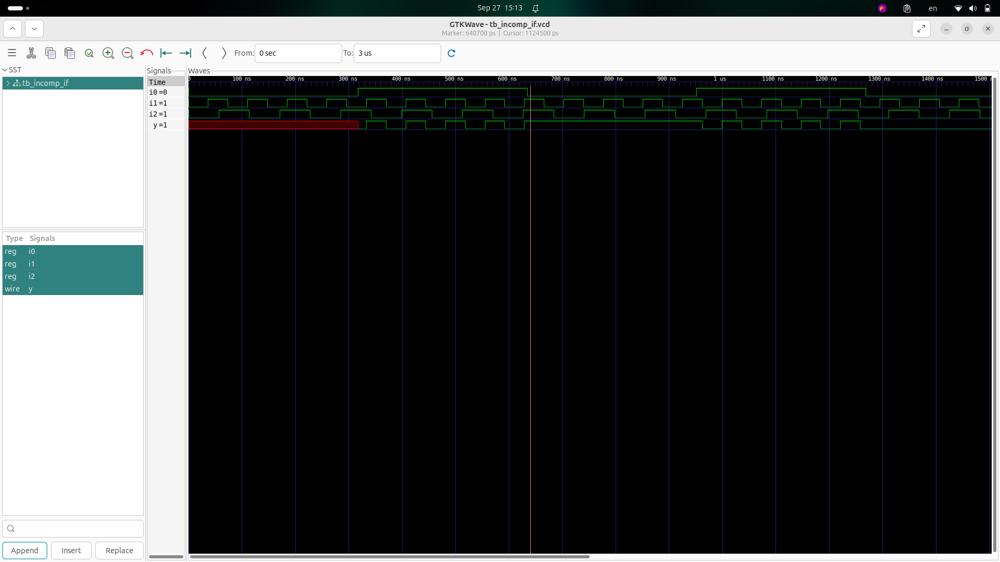

**Synthesized Netlist**:  
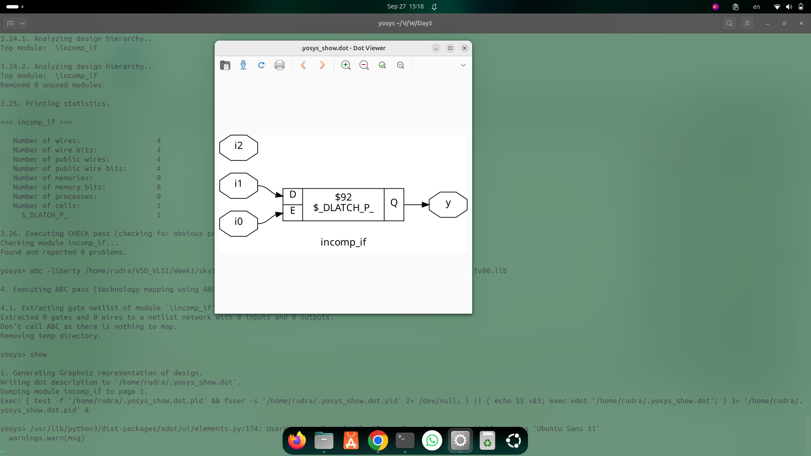

---

### Example 2: If with Else-if
```verilog
module incomp_if2 (input i0 , input i1 , input i2 , input i3, output reg y);
always @ (*)
begin
    if(i0)
        y <= i1;
    else if (i2)
        y <= i3;
end
endmodule
```

**Problem**: Missing final `else` → `y` undefined if neither `i0` nor `i2` is high → Latch inferred.

**Final Boolean Function**:  
`y = (i0) ? i1 : (i2 ? i3 : y_previous)`

**Waveform**:  


**Synthesized Netlist**:  


---

## 3. Labs on "Incomplete Overlapping Case"

### Example 1: Incomplete Case
```verilog
module incomp_case (input i0 , input i1 , input i2 , input [1:0] sel, output reg y);
always @ (*)
begin
    case(sel)
        2'b00 : y = i0;
        2'b01 : y = i1;
    endcase
end
endmodule
```

**Problem**: No assignment for `sel = 2'b10` or `2'b11` → Latch inferred.

**Final Boolean Function**:  
`y = (sel==2'b00)?i0 : (sel==2'b01)?i1 : y_previous`

**Waveform**:  
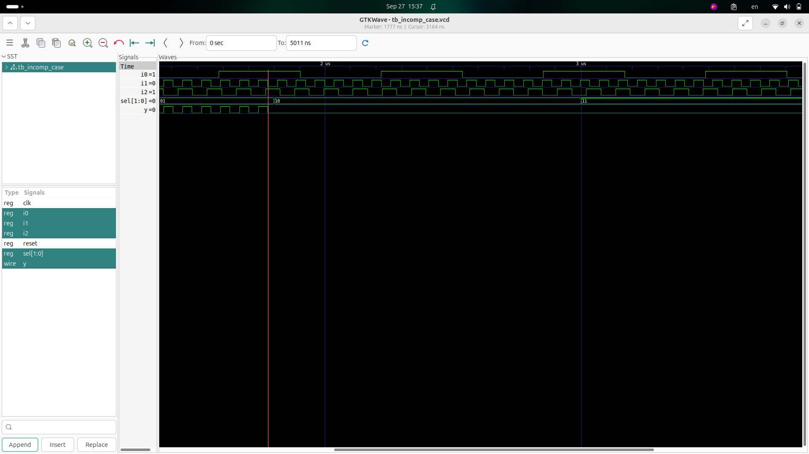

**Synthesized Netlist**:  
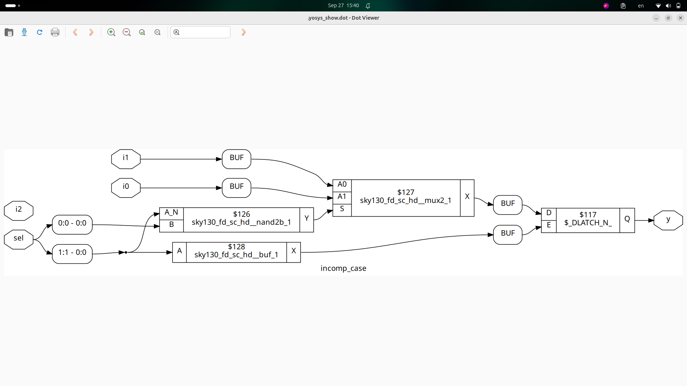

---

### Example 2: Complete Case with Default
```verilog
module comp_case (input i0 , input i1 , input i2 , input [1:0] sel, output reg y);
always @ (*)
begin
    case(sel)
        2'b00 : y = i0;
        2'b01 : y = i1;
        default : y = i2;
    endcase
end
endmodule
```

**Solution**: Default covers missing cases → No latch inference.

**Final Boolean Function**:  
`y = (sel==2'b00)?i0 : (sel==2'b01)?i1 : i2`

**Waveform**:  
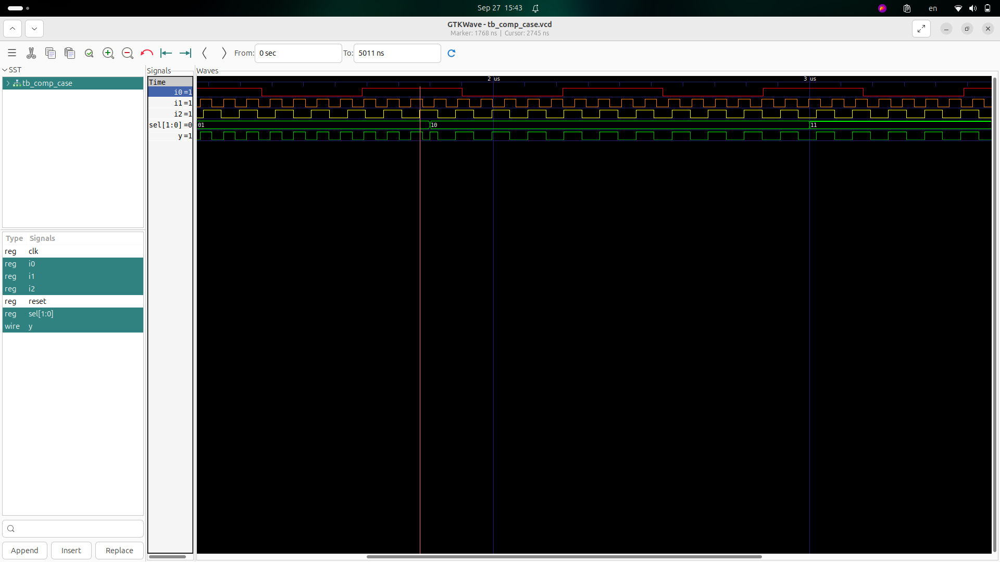

**Synthesized Netlist**:  
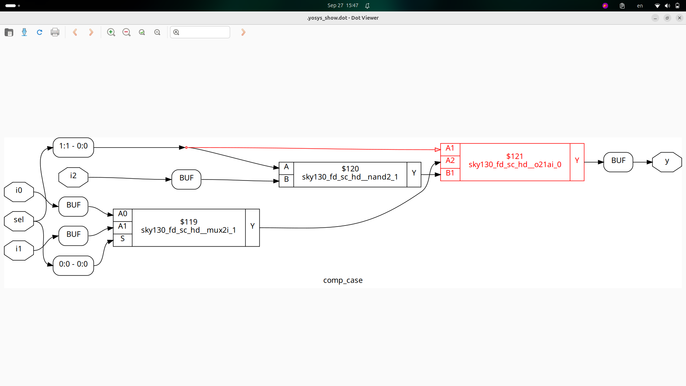

---

### Example 3: Partial Assignments in Case
```verilog
module partial_case_assign (input i0 , input i1 , input i2 , input [1:0] sel, output reg y , output reg x);
always @ (*)
begin
    case(sel)
        2'b00 : begin
            y = i0;
            x = i2;
        end
        2'b01 : y = i1;
        default : begin
            x = i1;
            y = i2;
        end
    endcase
end
endmodule
```

**Problem**: For `sel=01`, `x` is not assigned → Latch inferred.

**Final Boolean Function**:  
- `y = (sel==2'b00)?i0 : (sel==2'b01)?i1 : i2`  
- `x = (sel==2'b00)?i2 : (sel==2'b01)?x_previous : i1`

**Waveform**:  
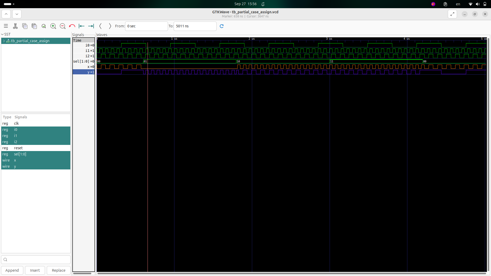

**Synthesized Netlist**:  
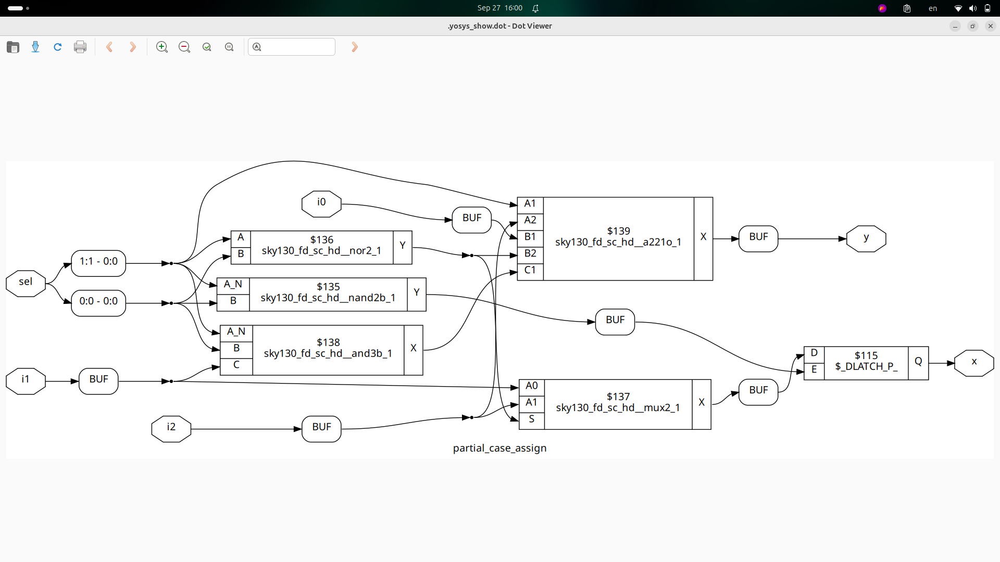

---

### Example 4: Bad Case (Overlapping Case)
```verilog
module bad_case (
    input i0,
    input i1,
    input i2,
    input i3,
    input [1:0] sel,
    output reg y
);
  always @(*) begin
    case (sel)
      2'b00: y = i0;
      2'b01: y = i1;
      2'b10: y = i2;
      2'b1?: y = i3;
     // 2'b11: y = i3;
    endcase
  end
endmodule
```

**Problem**: Overlapping patterns (`2'b1?` includes `2'b10` and `2'b11`) → Ambiguity in synthesis.

**Final Boolean Function**:  
`y = (sel==2'b00)?i0 : (sel==2'b01)?i1 : (sel==2'b10)?i2 : i3`

**Waveform**:  
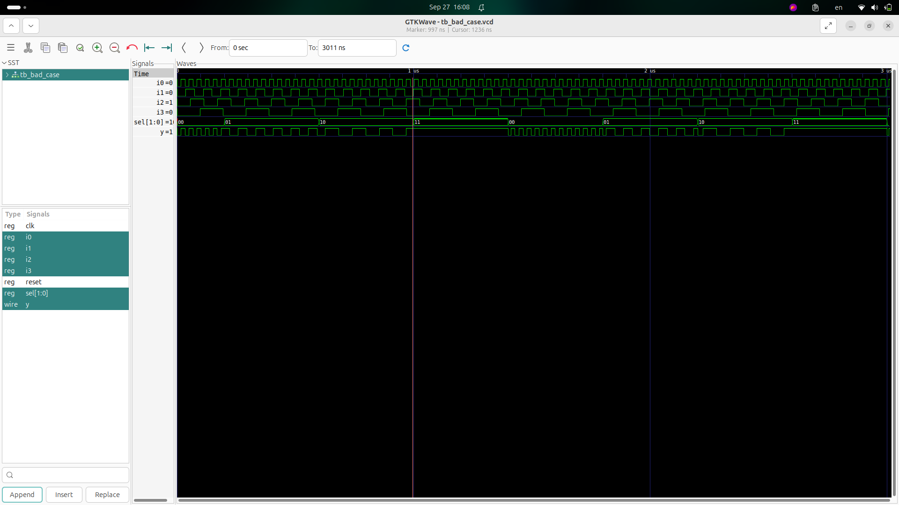

**Synthesized Netlist**:  


**GLS Simulation**:  


---

## 4. For Loop and For Generate

### **For Loop:**
The `for` loop is used in Verilog for repetitive tasks, primarily within testbenches and behavioral RTL code. It helps to iterate over a set of conditions or values for a specific number of iterations, simplifying tasks like checking multiple signals, applying stimuli, or performing computations across a range.

**Syntax Example:**
```verilog
for (initialization; condition; increment)
    statement;
```
#### Advantages:

- Simplifies repetitive logic.
- Reduces code duplication.
- Helps in modeling sequential tasks.

#### Use Cases:

- MUX (Multiplexer): When selecting one of several inputs based on a selector.
- DEMUX (Demultiplexer): Distributing input to one of several outputs.


### For Generate:

The for generate loop is used for structural replication of hardware modules. It's utilized when the same piece of hardware (e.g., an adder or a flip-flop) needs to be instantiated multiple times with different parameters. This allows hardware design scalability and modularity.

#### Syntax Example:
```
genvar i;
generate
    for (i = 0; i < N; i = i + 1) begin
        // Instance of module or logic here
    end
endgenerate
```
#### Advantages:

- Helps generate repetitive hardware structures.
- Reduces code duplication for hardware instantiation.
- Improves scalability and modularity.

#### Use Cases:

- Ripple Carry Adder: Adding multiple bits of two numbers, utilizing a carry for the next bit.


---

## 5. Labs on For Loop and For Generate

### 5.1 MUX Generate Using For Loop

In this example, we use a for loop to select one of the four inputs for a 4-to-1 multiplexer based on the sel input.
```verilog
module mux_generate (
    input i0,
    input i1,
    input i2,
    input i3,
    input [1:0] sel,
    output reg y
);
  wire [3:0] i_int;
  assign i_int = {i3, i2, i1, i0};
  integer k;
  always @(*) begin
    for (k = 0; k < 4; k = k + 1) begin
      if (k == sel) y = i_int[k];
      else y = y;
    end
  end
endmodule
```
Waveform:
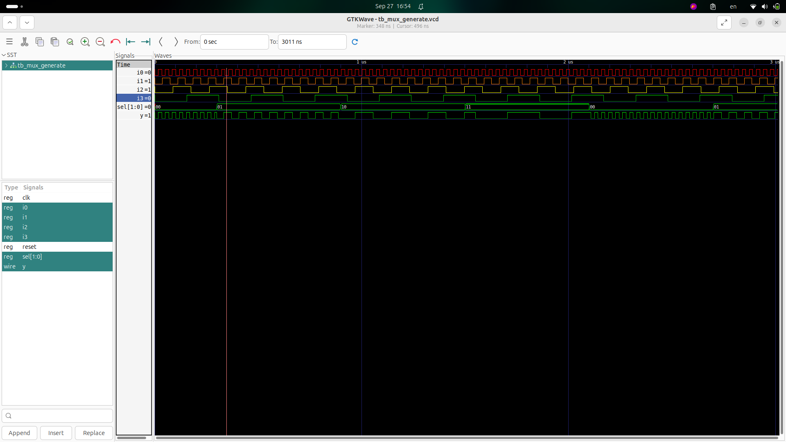
Netlist:
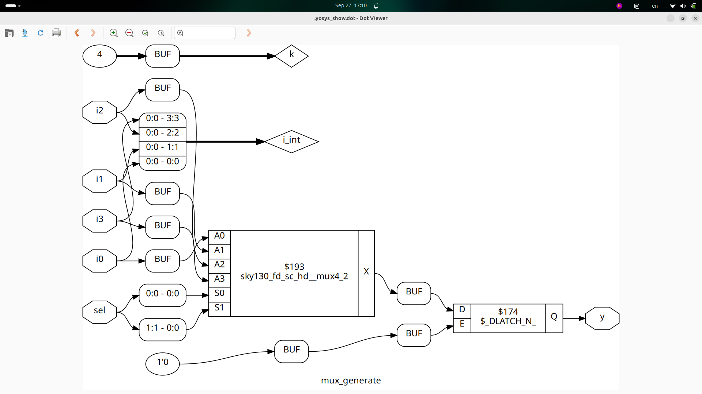
#### Problem:
- Latch at Y: The `y` signal gets latched because the value of `y` is only updated inside the loop based on the condition.

#### solution:
To avoid latch behavior, initialize `y` before the loop starts, ensuring the previous value is cleared or set to a known value.
```verilog
module mux_generate (
    input i0,
    input i1,
    input i2,
    input i3,
    input [1:0] sel,
    output reg y
);
  wire [3:0] i_int;
  assign i_int = {i3, i2, i1, i0};
  integer k;
  always @(*) begin
    y = 1'b0; //include this line
    for (k = 0; k < 4; k = k + 1) begin
      if (k == sel) y = i_int[k];
      else y = y;
    end
  end
endmodule
```
Netlist:
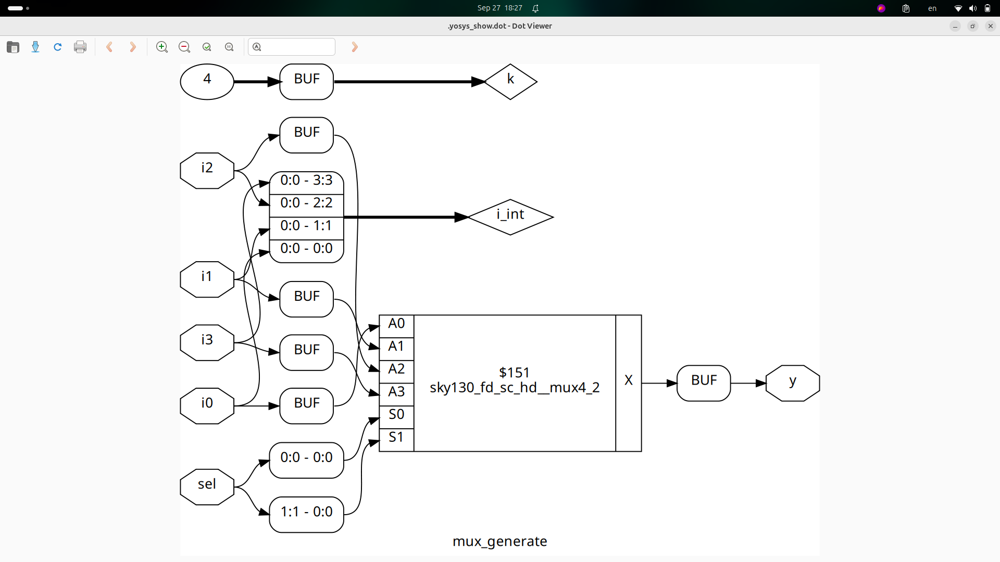

### 5.2 DEMUX Generate Using For Loop

This example demonstrates a demultiplexer (DEMUX) that routes a single input to one of eight outputs based on the `sel` input. The `for` loop helps select the appropriate output.
```verilog

module demux_generate (output o0 , output o1, output o2 , output o3, output o4, output o5, output o6 , output o7 , input [2:0] sel  , input i);
reg [7:0]y_int;
assign {o7,o6,o5,o4,o3,o2,o1,o0} = y_int;
integer k;
always @ (*)
begin
y_int = 8'b0;
for(k = 0; k < 8; k++) begin
	if(k == sel)
		y_int[k] = i;
end
end
endmodule
```
Waveform:
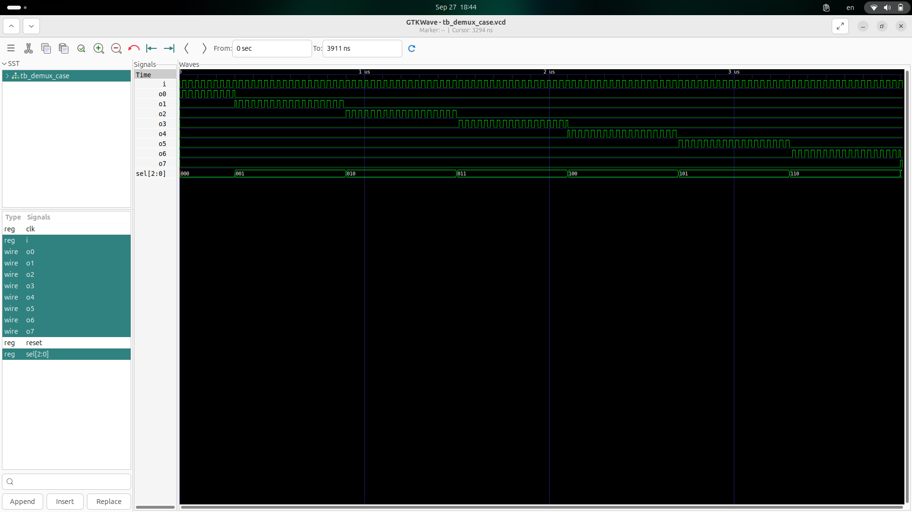
Netlist:
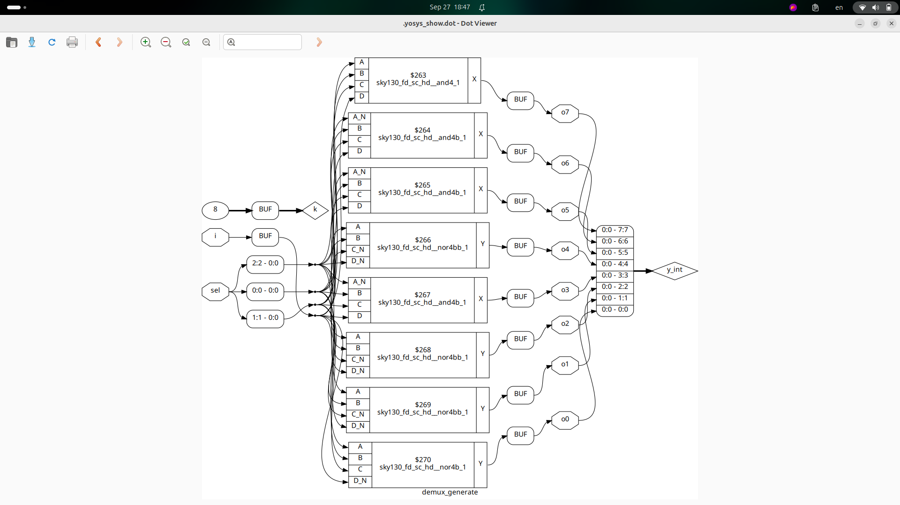

### 5.3 Ripple Carry Adder Using For Generate

A Ripple Carry Adder (RCA) adds two 8-bit numbers and provides the sum along with a carry-out. The `for generate` is used to instantiate multiple full adders for each bit position.
```verilog
module rca (input [7:0] num1 , input [7:0] num2 , output [8:0] sum);
wire [7:0] int_sum;
wire [7:0]int_co;
genvar i;
generate
	for (i = 1 ; i < 8; i=i+1) begin
		fa u_fa_1 (.a(num1[i]),.b(num2[i]),.c(int_co[i-1]),.co(int_co[i]),.sum(int_sum[i]));
	end

endgenerate
fa u_fa_0 (.a(num1[0]),.b(num2[0]),.c(1'b0),.co(int_co[0]),.sum(int_sum[0]));
assign sum[7:0] = int_sum;
assign sum[8] = int_co[7];
endmodule
```
Waveform:
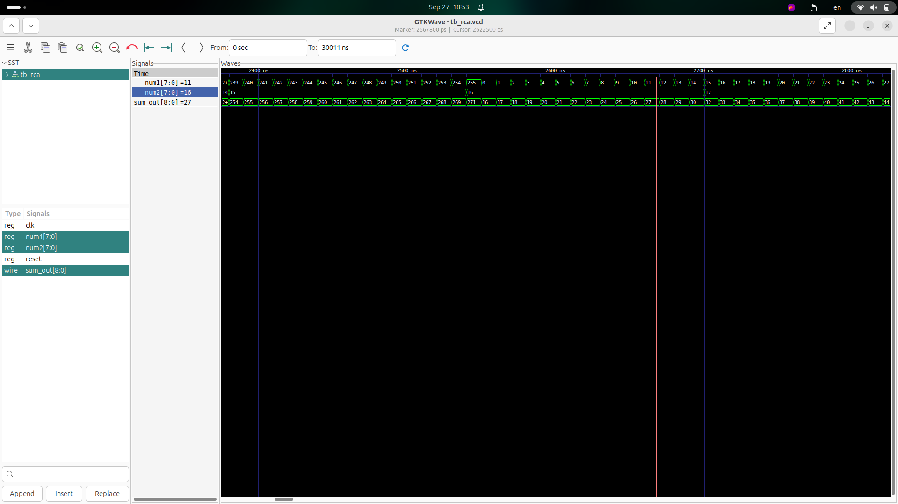
Netlist:
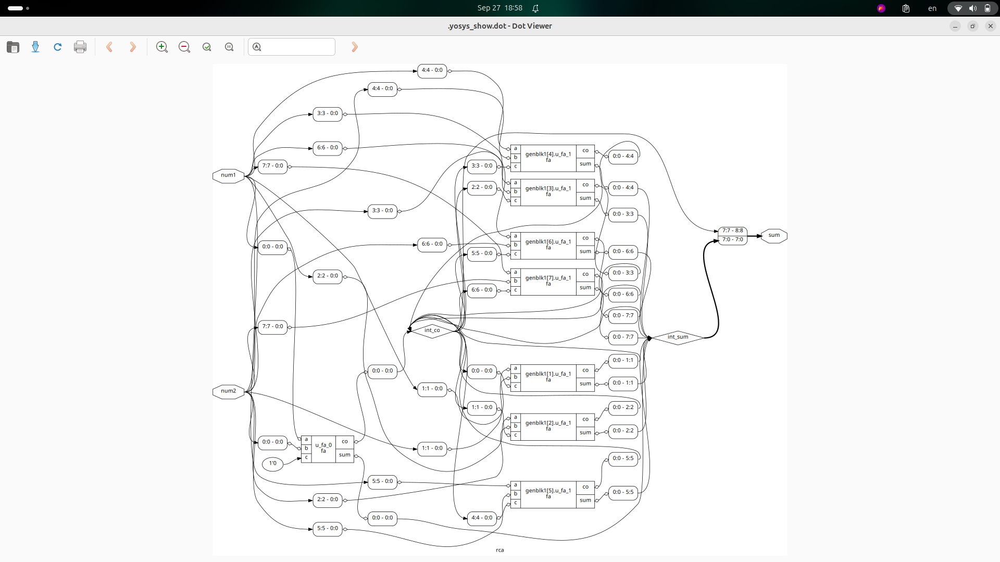
GLS:
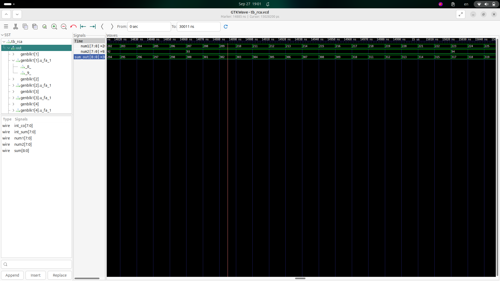


