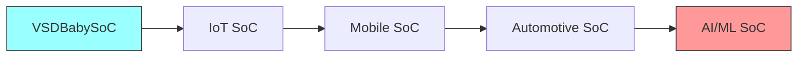

# Fundamentals of System on Chip (SoC) Design
Welcome to the repository for "Fundamentals of System on Chip (SoC) Design." This document serves as a comprehensive introduction to the world of SoCs, covering everything from the basic definition and core components to the complex design flows used in the industry.

Whether you're a student, an enthusiast, or a professional looking to refresh your knowledge, this guide will walk you through the key differences between SoCs, microcontrollers, and microprocessors. It also explores the various types of SoCs and their real-world applications.

A key feature of this guide is the introduction to VSDBabySoC, a simplified, open-source educational SoC. It is used as a practical example to demystify the SoC design process, demonstrating how a CPU, memory, and peripherals are integrated into a single, functional system using open-source tools.

---
## Table of Contents
<details>
<summary><strong>1. Understanding System on a Chip (SoC)</strong></summary>

A **System on Chip (SoC)** is a single integrated circuit (IC) that combines multiple system components into one chip. It provides the computational power of a traditional computer or embedded system in a compact, power-efficient, and scalable form.

Unlike a **microprocessor** that only contains the CPU, or a **microcontroller (MCU)** that combines CPU with some fixed peripherals and memory, an SoC integrates:

-   **CPU (Central Processing Unit)** – General-purpose processing
-   **GPU (Graphics Processing Unit)** – Rendering and graphics acceleration
-   **NPU / AI Accelerator** – For machine learning and neural networks
-   **Memory blocks** – SRAM, DRAM controllers, ROM, Cache
-   **Communication interfaces** – USB, UART, I2C, SPI, PCIe, Ethernet
-   **Multimedia components** – Audio/Video codecs, ISP (Image Signal Processor)
-   **Security modules** – Cryptographic engines, secure boot
-   **Power management** – PMIC, DVFS (Dynamic Voltage and Frequency Scaling)

### Why SoC instead of MCU or Microprocessor?

-   **Integration**: More components in one chip = less PCB space
-   **Performance**: Faster communication due to proximity of components
-   **Flexibility**: Can work with multiple types of RAM/ROM and peripherals
-   **Power Efficiency**: Optimized for high performance per watt
-   **Cost**: Economical at scale, especially for mass-market products

---

### Key Differences: SoC vs Microcontroller vs Microprocessor

| Feature                  | SoC                                     | Microcontroller (MCU)                  | Microprocessor (CPU only)           |
| ------------------------ | --------------------------------------- | -------------------------------------- | ----------------------------------- |
| **Integration** | CPU + GPU + NPU + Peripherals + Memory  | CPU + limited peripherals + small memory | CPU core only                       |
| **Flexibility** | High, supports multiple external components | Low, fixed peripherals                 | Needs external components           |
| **Performance** | High (multi-core, accelerators)         | Low/Moderate                           | Moderate                            |
| **Applications** | Smartphones, Laptops, Cars              | IoT devices, appliances                | PCs, servers (with chipset support) |
| **Efficiency** | High (optimized per application)        | Moderate                               | Lower (depends on external chips)   |

---

### Real-World Applications of SoC

-   **Consumer Electronics:** Smartphones, Smart TVs, Tablets, Smartwatches
-   **Automotive:** Advanced Driver Assistance Systems (ADAS), Infotainment systems
-   **Industrial IoT:** Smart sensors, predictive maintenance devices
-   **Healthcare:** Wearables, medical imaging processors
-   **High-performance computing:** Apple M-series, Nvidia Orin

*Example:* Qualcomm **Snapdragon 8 Gen 5** integrates CPU, GPU, AI Engine, and 5G Modem in one SoC for flagship smartphones.

---

</details>

<details>
<summary><strong>2. Types of SoCs and SoC Design Flow</strong></summary>

SoC Design & Manufacturing Flow

Explanation of Each Step

</details>

<details>
<summary><strong>3. Introduction to VSDBabySoC</strong></summary>

3.1 Objectives of VSDBabySoC

3.2 Features of VSDBabySoC

3.3 Block Diagram of VSDBabySoC

3.4 Comparison: VSDBabySoC vs Commercial SoCs

3.5 Complexity vs Application Graph

</details>

A **System on Chip (SoC)** is a single integrated circuit (IC) that combines multiple system components into one chip.  
It provides the computational power of a traditional computer or embedded system in a compact, power-efficient, and scalable form.

Unlike a **microprocessor** that only contains the CPU, or a **microcontroller (MCU)** that combines CPU with some fixed peripherals and memory,  
an SoC integrates:

- **CPU (Central Processing Unit)** – General-purpose processing
- **GPU (Graphics Processing Unit)** – Rendering and graphics acceleration
- **NPU / AI Accelerator** – For machine learning and neural networks
- **Memory blocks** – SRAM, DRAM controllers, ROM, Cache
- **Communication interfaces** – USB, UART, I2C, SPI, PCIe, Ethernet
- **Multimedia components** – Audio/Video codecs, ISP (Image Signal Processor)
- **Security modules** – Cryptographic engines, secure boot
- **Power management** – PMIC, DVFS (Dynamic Voltage and Frequency Scaling)

### Why SoC instead of MCU or Microprocessor?
- **Integration**: More components in one chip = less PCB space
- **Performance**: Faster communication due to proximity of components
- **Flexibility**: Can work with multiple types of RAM/ROM and peripherals
- **Power Efficiency**: Optimized for high performance per watt
- **Cost**: Economical at scale, especially for mass-market products

---

### Key Differences: SoC vs Microcontroller vs Microprocessor

| Feature                  | SoC | Microcontroller (MCU) | Microprocessor (CPU only) |
|--------------------------|-----|------------------------|----------------------------|
| **Integration**          | CPU + GPU + NPU + Peripherals + Memory | CPU + limited peripherals + small memory | CPU core only |
| **Flexibility**          | High, supports multiple external components | Low, fixed peripherals | Needs external components |
| **Performance**          | High (multi-core, accelerators) | Low/Moderate | Moderate |
| **Applications**         | Smartphones, Laptops, Cars | IoT devices, appliances | PCs, servers (with chipset support) |
| **Efficiency**           | High (optimized per application) | Moderate | Lower (depends on external chips) |

---

### Real-World Applications of SoC
- **Consumer Electronics:** Smartphones, Smart TVs, Tablets, Smartwatches
- **Automotive:** Advanced Driver Assistance Systems (ADAS), Infotainment systems
- **Industrial IoT:** Smart sensors, predictive maintenance devices
- **Healthcare:** Wearables, medical imaging processors
- **High-performance computing:** Apple M-series, Nvidia Orin

*Example:* Qualcomm **Snapdragon 8 Gen 5** integrates CPU, GPU, AI Engine, and 5G Modem in one SoC for flagship smartphones.

---

## 2. Types of SoCs and SoC Design Flow

SoCs can be classified based on their **target application**:

| Type of SoC              | Description | Examples |
|--------------------------|-------------|----------|
| **Mobile SoC**           | Optimized for smartphones & tablets. Balance of power and efficiency. | Snapdragon 8 Gen, Apple A17 Pro |
| **Automotive SoC**       | Designed for autonomous driving, ADAS, infotainment, safety-critical apps. | Nvidia DRIVE, Renesas R-Car |
| **IoT SoC**              | Ultra-low-power chips for connectivity and sensors. | Espressif ESP32, Nordic nRF52840 |
| **AI/ML SoC**            | AI accelerators, NPUs, and ML cores for inference and training. | Google TPU, Habana Gaudi |
| **General-purpose SoC**  | Balanced CPU+GPU for laptops and desktops. | Apple M2, AMD Ryzen SoC |
| **Networking SoC**       | Handles routers, switches, 5G base stations. | Broadcom BCM series, Qualcomm X-series |

---

### SoC Design & Manufacturing Flow

The design and fabrication of an SoC follow a **systematic process** from specification to silicon tapeout.  

#### Flowchart: SoC Design & Manufacturing Process

```mermaid
flowchart TD
   A[System Specification] --> B[Architecture Design]
    B --> C[IP Selection & Integration]
    C --> D[RTL Design (HDL Coding)]
    D --> E[Functional Verification]
    E --> F[Logic Synthesis]
    F --> G[Design-for-Test (DFT) Insertion]
    G --> H[Place & Route (Physical Design)]
    H --> I[Timing Analysis & Verification]
    I --> J[Signoff Checks (Power, IR-drop, EM, LVS/DRC)]
    J --> K[Tape-out]
    K --> L[Fabrication (Wafer Processing)]
    L --> M[Packaging & Testing]
    M --> N[Mass Production & Deployment]
```
### Explanation of Each Step

1. System Specification

- Define target application, performance goals, power limits, and cost.

- Example: Smartphone SoC → needs CPU+GPU+5G modem under <5W power.

2. Architecture Design

- Decide CPU type (ARM, RISC-V, x86), memory hierarchy, bus system, cache levels.

3. IP Selection & Integration

- Choose IP blocks (CPU core, GPU, DSP, peripherals).

- Some IPs are licensed (ARM), some custom, some open-source (RISC-V).

4. RTL Design

- Use Verilog/VHDL to describe functionality of blocks.

- Example: RTL for memory controller, UART, ALU.

5. Functional Verification

- Ensure RTL meets design intent using simulation, testbenches, and formal verification.

6. Logic Synthesis

- Convert RTL → Gate-level netlist using standard cell libraries.

7. DFT (Design for Test)

- Insert scan chains, Built-in-Self-Test (BIST) logic to check chip after fabrication.

8. Place & Route (Physical Design)

- Map gates on silicon floorplan.

- Route interconnections ensuring performance & minimal congestion.

9. Timing Analysis & Verification

- Check setup/hold times, remove timing violations, run power analysis.

10. Signoff Checks

- LVS (Layout vs Schematic), DRC (Design Rule Check), IR-drop, Electromigration.

11. Tape-out

- Final layout GDSII sent to foundry.

12. Fabrication

- Foundry manufactures chip on silicon wafer using lithography.

13. Packaging & Testing

- Chip is cut, packaged, and electrically tested.

14. Mass Production

- Chips are manufactured in high volume and integrated into systems.

## 3. Introduction to VSDBabySoC

The **VSDBabySoC** is a simplified, open-source educational System on Chip (SoC) project created to help students and enthusiasts understand the **fundamentals of SoC design**. Unlike commercial SoCs that are highly complex and closed-source, VSDBabySoC is designed for **learning, experimentation, and research**.  

It is built using a **RISC-V based processor core** and a few basic peripherals, keeping the design minimal while still demonstrating the **core concepts of integration, verification, and SoC bring-up**.

---

### 3.1 Objectives of VSDBabySoC
- Provide a **hands-on approach** to SoC design for beginners.
- Demonstrate the **integration of CPU, memory, and I/O** into a single system.
- Use **open-source EDA tools** (e.g., Yosys, OpenLane, Verilator) to show complete SoC design flow.
- Encourage understanding of **RISC-V ISA**, which is open and extensible.
- Show the **educational pathway** from RTL design to final SoC implementation.

---

### 3.2 Features of VSDBabySoC
- **CPU Core:** Single RISC-V core (simple and open-source).
- **Memory:** Basic SRAM model for program/data storage.
- **Peripherals:**
  - UART for serial communication
  - GPIO for basic input/output operations
- **Design Environment:** Developed entirely using open-source tools.
- **Target Use Case:** Learning SoC design fundamentals, not commercial deployment.

---

### 3.3 Block Diagram of VSDBabySoC

The VSDBabySoC follows a minimal architecture where a **RISC-V CPU core** communicates with memory and peripherals through a simple interconnect.  
The main components are:

- **CPU (RISC-V core):** Executes instructions and controls the flow of data.  
- **Memory (SRAM):** Stores instructions and data for the CPU.  
- **UART (Universal Asynchronous Receiver/Transmitter):** Provides serial communication with external devices.  
- **GPIO (General Purpose Input/Output):** Allows basic input and output control.  

---

#### Block Diagram (ASCII Representation)
``` 
+--------------------------------------------------+
|                   VSDBabySoC                     |
|                                                  |
|   +-----------------+                            |
|   |   RISC-V CPU    |                            |
|   +--------+--------+                            |
|            |                                     |
|   +--------v--------+     +-------------------+  |
|   |     Memory      |     |        UART       |  |
|   |     (SRAM)      |     | Serial Interface  |  |
|   +-----------------+     +-------------------+  |
|            |                                     |
|   +--------v--------+                            |
|   |      GPIO       |  Input/Output Control      |
|   +-----------------+                            |
|                                                  |
+--------------------------------------------------+
``` 
---

### 3.4 Comparison: VSDBabySoC vs Commercial SoCs

| Feature              | VSDBabySoC | Commercial Mobile SoC |
|----------------------|------------|------------------------|
| **CPU**              | Single RISC-V core | Multi-core ARM Cortex-X/A |
| **GPU**              | None | Integrated Adreno/Apple GPU |
| **Memory**           | Simple SRAM | DDR/LPDDR, Cache, Flash |
| **Interfaces**       | UART, GPIO | USB, PCIe, WiFi, 5G, HDMI |
| **Power Management** | Minimal | Advanced PMIC, DVFS |
| **Design Tools**     | Open-source (Yosys, OpenLane) | Proprietary (Synopsys, Cadence, Mentor) |
| **Use Case**         | Education & Research | Smartphones, Laptops |

---

### 3.5 Complexity vs Application Graph

The complexity of an SoC depends on its **target application domain**.  
VSDBabySoC sits at the lower end (educational/research), while AI/Automotive SoCs are at the higher end.

---

#### Table Representation

| Application Domain | Example SoC               | Complexity Level |
|--------------------|---------------------------|------------------|
| **VSDBabySoC**     | Educational RISC-V SoC    | Very Low         |
| **IoT SoC**        | Espressif ESP32, nRF52    | Low/Medium       |
| **Mobile SoC**     | Snapdragon 8 Gen, Apple A17 | High           |
| **Automotive SoC** | Nvidia DRIVE, Renesas R-Car | Very High       |
| **AI/ML SoC**      | Google TPU, Habana Gaudi  | Extreme          |

---
#### Mermaid Chart Representation




